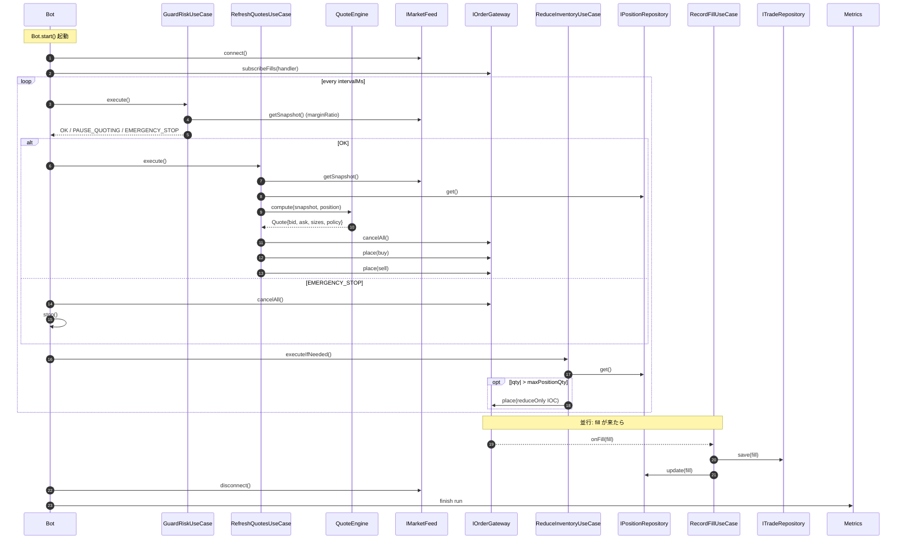
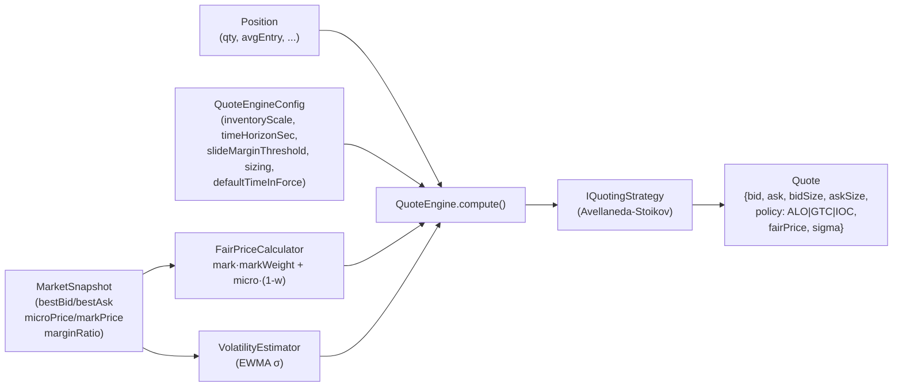
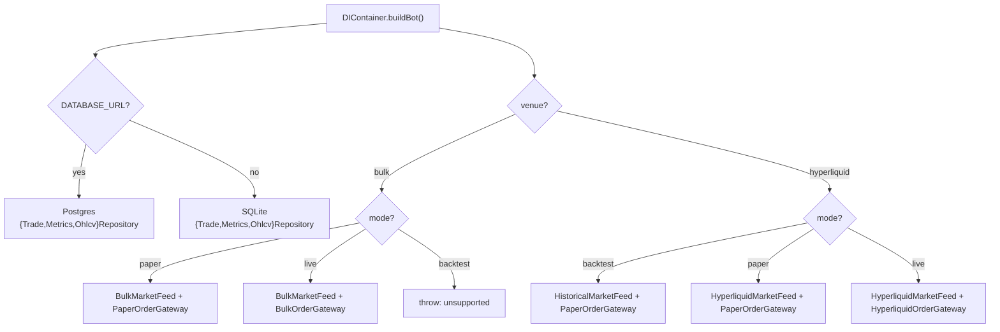
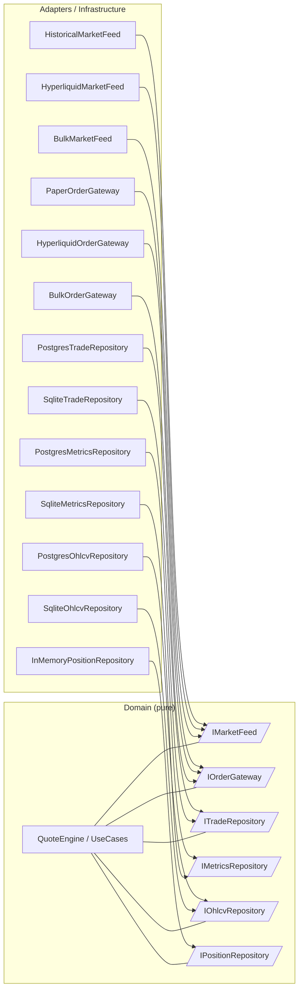
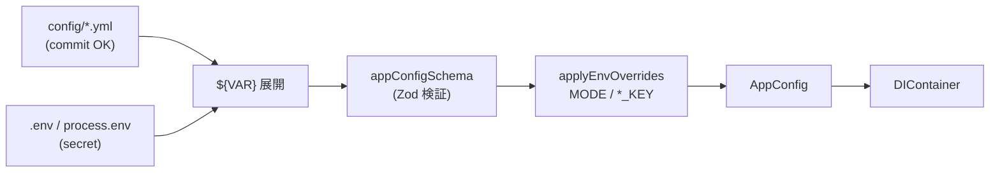
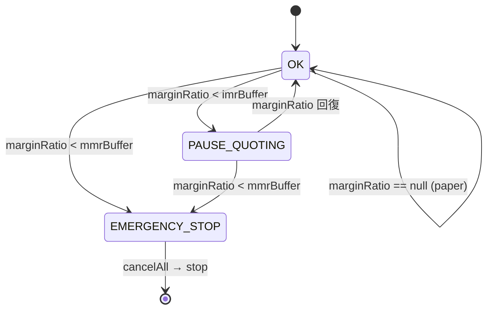
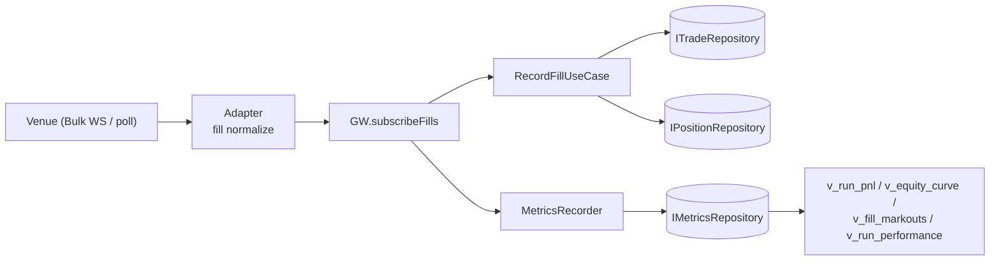

# ARCHITECTURE

`simple-mm-bot` の構成と設計を視覚的にまとめた図解ドキュメント。
詳細な責務定義は [`STRUCTURE.md`](./STRUCTURE.md)、要件は [`PRD.md`](./PRD.md)、技術選定は [`TECH.md`](./TECH.md) を参照。

主対象 venue は **Bulk Trade**、戦略は **Avellaneda-Stoikov**、ランタイムは **Bun + TypeScript**。

---

## 1. 全体像 (Bird's-Eye View)

外部世界 (venue / DB) を adapter / infrastructure で隔離し、純粋な domain ロジックを `Bot` ループから駆動する Clean Architecture。

```mermaid
flowchart LR
    subgraph External["External world"]
        Venue["Venue API\n(Bulk / Hyperliquid)"]
        DB[("SQLite / Postgres")]
        ENV["env / YAML\n(config)"]
    end

    subgraph Boot["Boot"]
        Main["main.ts"]
        Cfg["ConfigLoader"]
        DI["DIContainer"]
    end

    subgraph App["Application layer"]
        Bot["Bot (tick loop)"]
        UC["UseCases\n- GuardRisk\n- RefreshQuotes\n- RecordFill\n- ReduceInventory"]
    end

    subgraph Domain["Domain layer (pure)"]
        QE["QuoteEngine"]
        Strat["AvellanedaStoikovStrategy"]
        Fair["FairPriceCalculator"]
        Vol["VolatilityEstimator"]
        Ana["Analytics"]
        Ports[["Ports\nIMarketFeed / IOrderGateway\nITradeRepository\nIOhlcvRepository / IPositionRepository"]]
    end

    subgraph Adapters["Adapters"]
        Bulk["bulk/\nBulkMarketFeed\nBulkOrderGateway"]
        HL["hyperliquid/\nHyperliquidMarketFeed\nHyperliquidOrderGateway"]
        Paper["paper/\nHistoricalMarketFeed\nPaperOrderGateway"]
    end

    subgraph Infra["Infrastructure"]
        Repos["sqlite / postgres\nTrade / Metrics / Ohlcv repositories\nInMemoryPositionRepository"]
    end

    ENV --> Cfg --> DI --> Bot
    Main --> Cfg
    Bot --> UC --> QE
    QE --> Strat & Fair & Vol
    UC -.uses.-> Ports
    Ports <-. implements .- Bulk
    Ports <-. implements .- HL
    Ports <-. implements .- Paper
    Ports <-. implements .- Repos
    Bulk --> Venue
    HL --> Venue
    Repos --> DB
    UC --> Ana
```

> Domain は外側を一切 import しない。adapter/infra は domain ports を実装するだけ。
> 矢印が常に外 → 内 (domain) に向かうのがポイント。

---

## 2. レイヤー責務 (4 層)

| Layer              | 役割                               | 依存可能先                 | 代表ファイル                                   |
| ------------------ | ---------------------------------- | -------------------------- | ---------------------------------------------- |
| **Domain**         | quoting / risk の純粋ロジック      | なし                       | `domain/QuoteEngine.ts`, `domain/strategy/*`   |
| **Application**    | tick loop, use case orchestration  | domain                     | `application/Bot.ts`, `application/usecases/*` |
| **Adapters**       | venue 固有 protocol を port に変換 | domain ports + venue SDK   | `adapters/bulk/*`, `adapters/hyperliquid/*`    |
| **Infrastructure** | DB client / schema / repository    | domain ports + storage lib | `infrastructure/db/{sqlite,postgres}/*`        |

依存方向は **常に内向き**。違反したら CI / lint で落とすのが原則。

---

## 3. ディレクトリ構成

```text
src/
├── main.ts                 # 起動エントリポイント (薄い)
├── config.ts               # YAML + env を Zod で検証
├── env.ts                  # secret env スキーマ
├── application/
│   ├── Bot.ts              # tick loop 本体
│   ├── di.ts               # venue × mode → 具体 adapter を解決
│   └── usecases/           # GuardRisk / RefreshQuotes / RecordFill / ReduceInventory
├── domain/
│   ├── entities/           # Quote / Fill / Position / PerformanceMetrics
│   ├── ports/              # IMarketFeed / IOrderGateway / I*Repository
│   ├── strategy/           # IQuotingStrategy + Avellaneda-Stoikov
│   ├── QuoteEngine.ts      # 戦略 + fair + vol + sizing の合成点
│   ├── FairPriceCalculator.ts
│   ├── VolatilityEstimator.ts
│   └── Analytics.ts        # PnL / markout / sharpe / drawdown
├── adapters/
│   ├── bulk/               # primary (BulkMarketFeed / BulkOrderGateway)
│   ├── hyperliquid/        # legacy + backtest path
│   └── paper/              # venue 非依存の sim execution
├── infrastructure/
│   ├── InMemoryPositionRepository.ts
│   └── db/{sqlite,postgres}/{client.ts, schema.ts, repository/*}
└── lib/hyperliquid/        # Hyperliquid SDK ラッパ (lib に閉じ込め)
```

---

## 4. tick ループ (1 周の流れ)

`Bot.start()` は無限ループで以下を実行する。`mode` / `venue` を知らない共通ループに保たれている点が肝。



---

## 5. QuoteEngine の内部構造

`QuoteEngine` は **fair price / volatility / sizing / strategy** の合成点であり、戦略を差し替えても入出力は変わらない。



- `gamma = 0` で fixed-spread と等価になるので、戦略追加なしで挙動を切り替えられる。
- Bulk 既定の `defaultTimeInForce` は `GTC`。

---

## 6. DI マトリクス (venue × mode)

`DIContainer` が config の `venue` / `mode` を見て adapter を解決する単一ポイント。

| venue         | mode       | MarketFeed              | OrderGateway              | status                       |
| ------------- | ---------- | ----------------------- | ------------------------- | ---------------------------- |
| `bulk`        | `paper`    | `BulkMarketFeed`        | `PaperOrderGateway`       | **primary**                  |
| `bulk`        | `live`     | `BulkMarketFeed`        | `BulkOrderGateway`        | **primary** (要 PRIVATE_KEY) |
| `bulk`        | `backtest` | -                       | -                         | **明示的にエラー**           |
| `hyperliquid` | `backtest` | `HistoricalMarketFeed`  | `PaperOrderGateway`       | 暫定の過去検証               |
| `hyperliquid` | `paper`    | `HyperliquidMarketFeed` | `PaperOrderGateway`       | legacy compatibility         |
| `hyperliquid` | `live`     | `HyperliquidMarketFeed` | `HyperliquidOrderGateway` | legacy compatibility         |

DB は `DATABASE_URL` の有無で解決される。



---

## 7. Ports & Adapters (六角形図)

domain は port (interface) を公開し、adapter / infra が実装する。



---

## 8. Config / Secrets フロー



- secret は `BULK_PRIVATE_KEY` (Bulk) / `HL_SECRET_KEY` (Hyperliquid) のみ。
- secret 系 env は **`src/env.ts` と config 展開以外で読まない**。
- 既定の `CONFIG_PATH` は `config/config.bulk.yml`。

---

## 9. Risk State Machine

`GuardRiskUseCase` が tick の最初に判定し、`Bot` が状態に応じて分岐する。



- `PAUSE_QUOTING` 中は新規 quote を出さない (= refreshQuotes をスキップ)。
- `EMERGENCY_STOP` で `cancelAll()` 後 bot を停止。

---

## 10. データフロー (Fill → Metrics Views)



runtime は report JSON を保存しない。PnL、markout、order quality は保存済み fact から view で計算する。

---

## 11. 設計上の不変条件 (チェックリスト)

- [ ] `src/domain/**` が `application` / `adapters` / `infrastructure` を import しない
- [ ] Bulk SDK の import は `src/adapters/bulk/` だけ
- [ ] Hyperliquid SDK の import は `src/lib/hyperliquid/` と `src/adapters/hyperliquid/` だけ
- [ ] secret env は `src/env.ts` と config 展開以外から読まない
- [ ] 新規 venue 追加 = `adapters/<venue>/` + `DIContainer` の分岐追加だけで済む
- [ ] 新規 strategy 追加 = `IQuotingStrategy` 実装 + config schema 拡張だけで済む
- [ ] `live` / `paper` / `backtest` で application 層の振る舞いが揃っている
