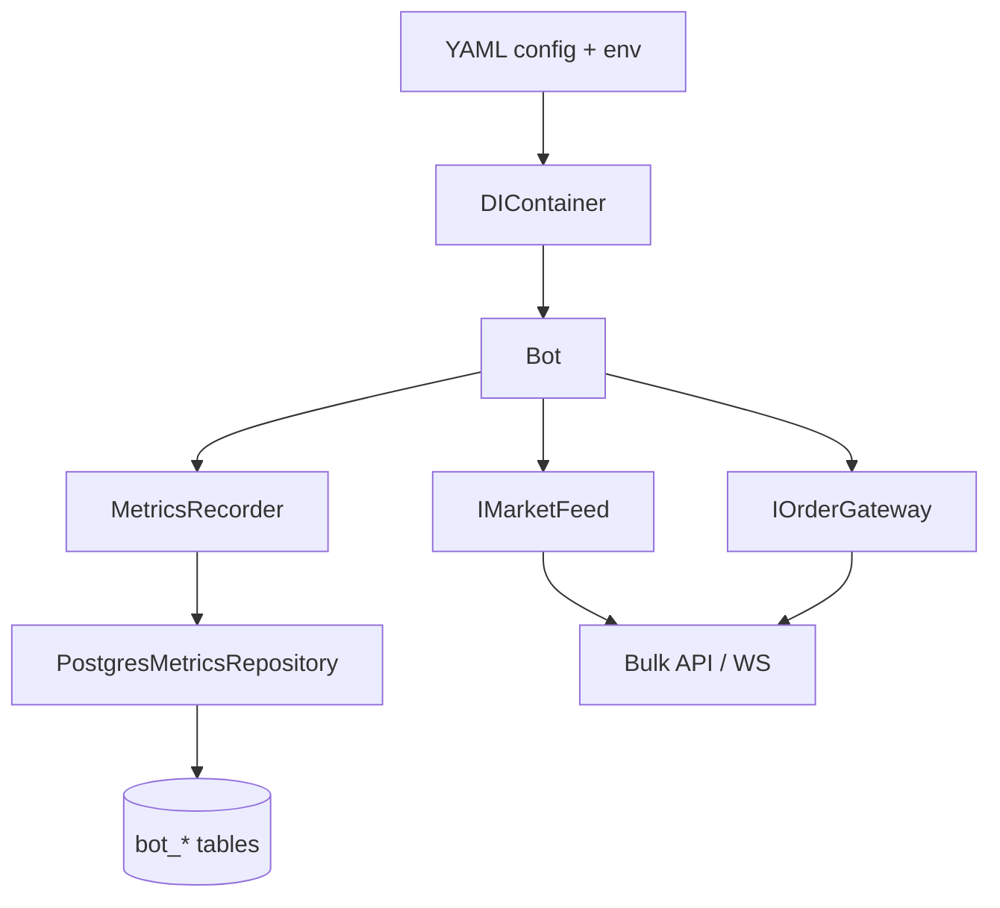
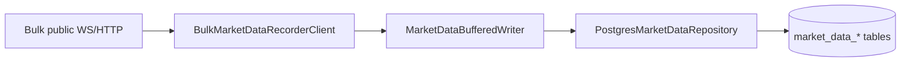
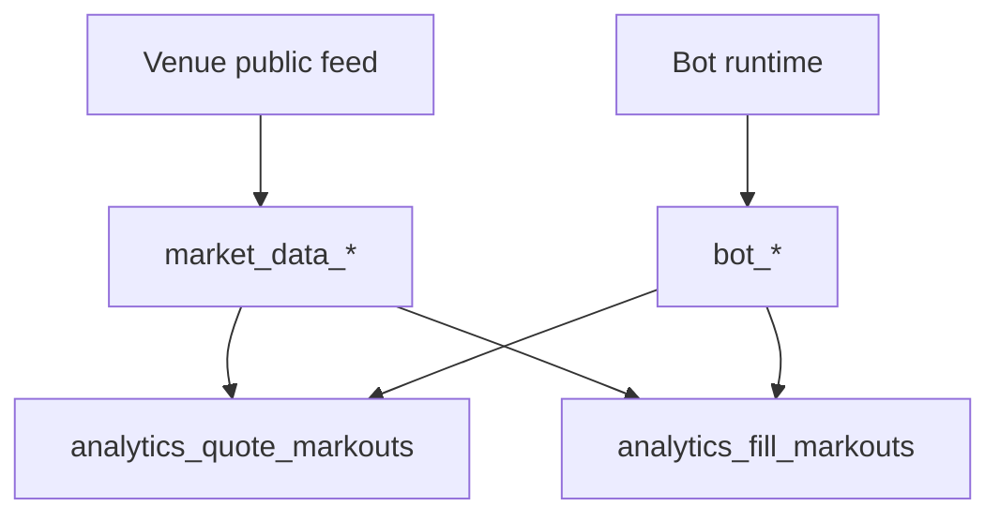
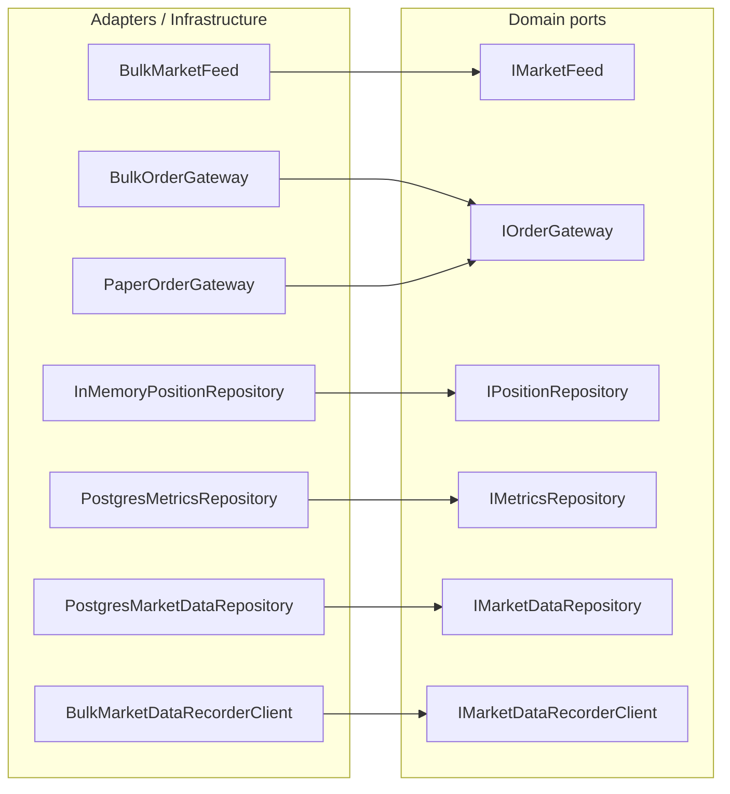
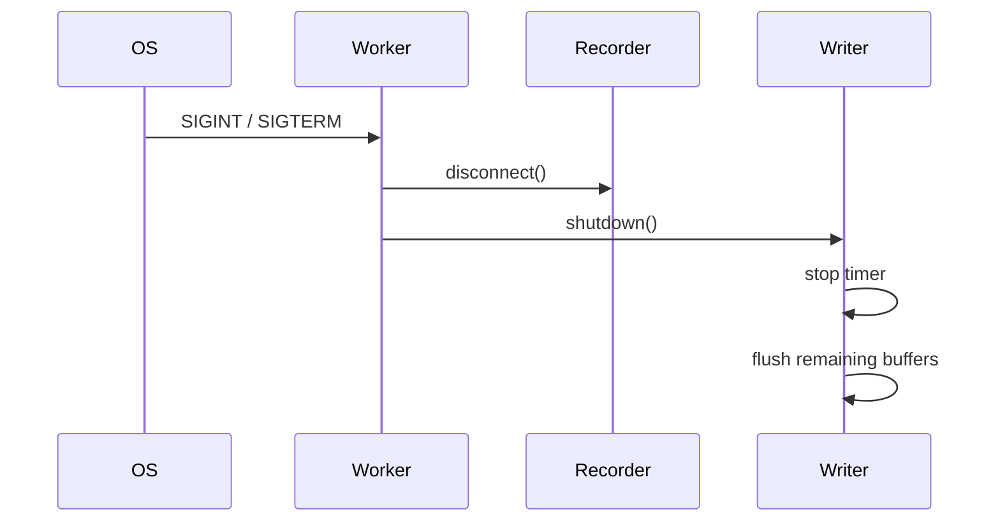

# ARCHITECTURE

See [STRUCTURE.md](./STRUCTURE.md), [TECH.md](./TECH.md), and [DATABASE.md](./DATABASE.md) for detailed responsibilities.

## High-Level Runtime

## Market Data Recorder

The recorder is a separate process from the bot. It writes only venue market facts.

## Database Separation

`market_data_*` answers what the venue showed. `bot_*` answers what the bot observed, decided, submitted, and filled.

## Venue And Mode Matrix

| venue         | mode       | MarketFeed              | OrderGateway              |
| ------------- | ---------- | ----------------------- | ------------------------- |
| `bulk`        | `live`     | `BulkMarketFeed`        | `BulkOrderGateway`        |
| `bulk`        | `paper`    | `BulkMarketFeed`        | `PaperOrderGateway`       |
| `bulk`        | `backtest` | `HistoricalMarketFeed`  | `PaperOrderGateway`       |
| `hyperliquid` | `live`     | `HyperliquidMarketFeed` | `HyperliquidOrderGateway` |
| `hyperliquid` | `paper`    | `HyperliquidMarketFeed` | `PaperOrderGateway`       |
| `hyperliquid` | `backtest` | `HistoricalMarketFeed`  | `PaperOrderGateway`       |

## Ports And Implementations

Domain and application depend on ports. Adapters and infrastructure implement them.

## Shutdown

The recorder logs final flush results before exiting.
