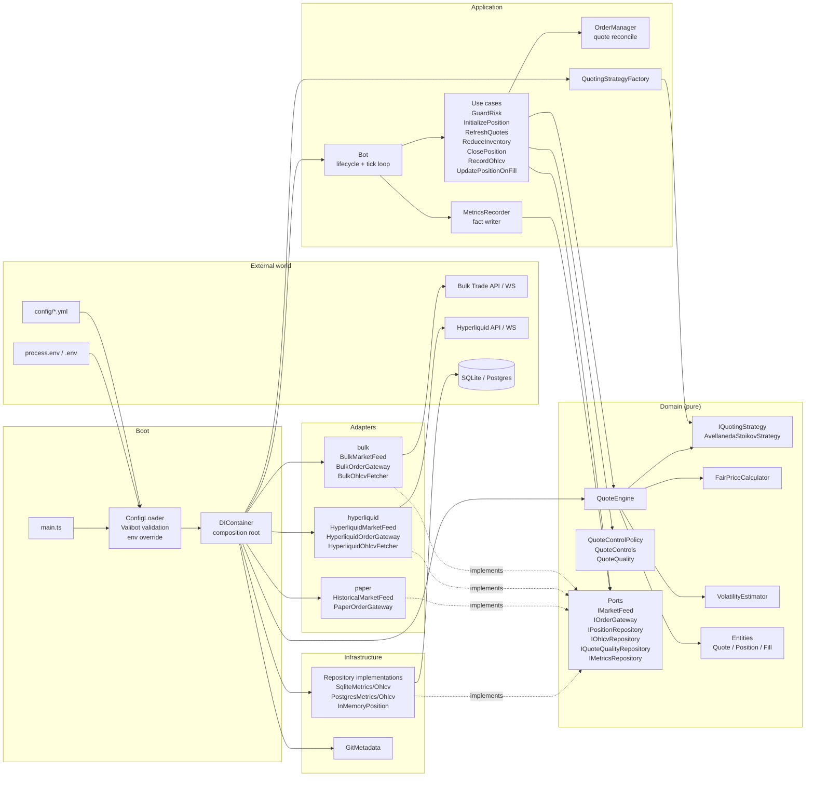
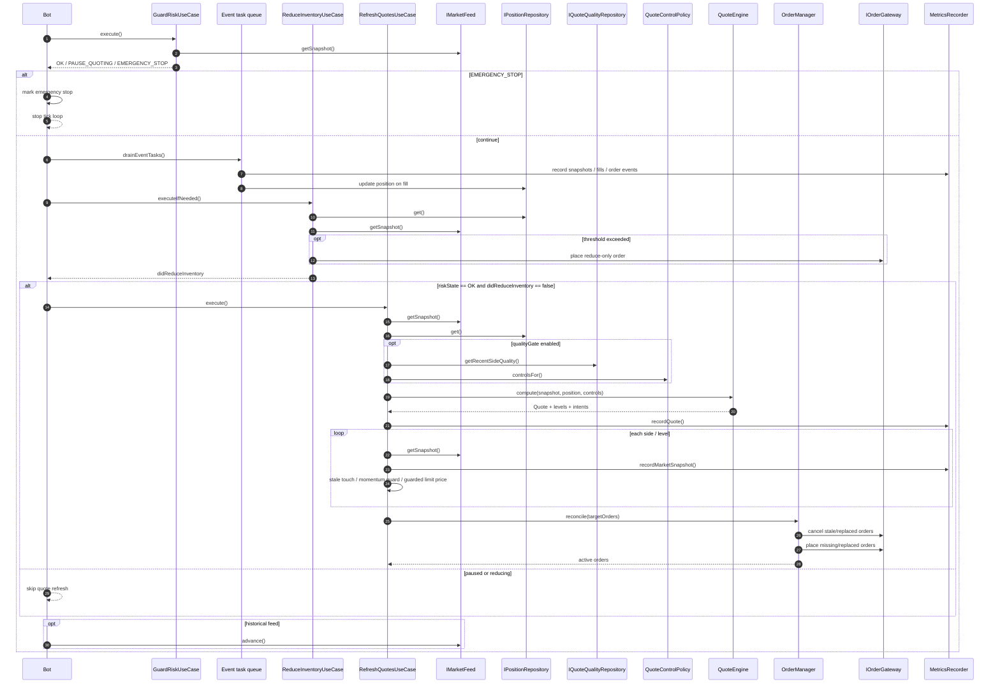
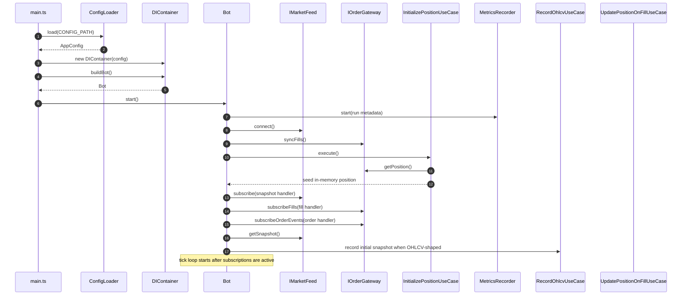
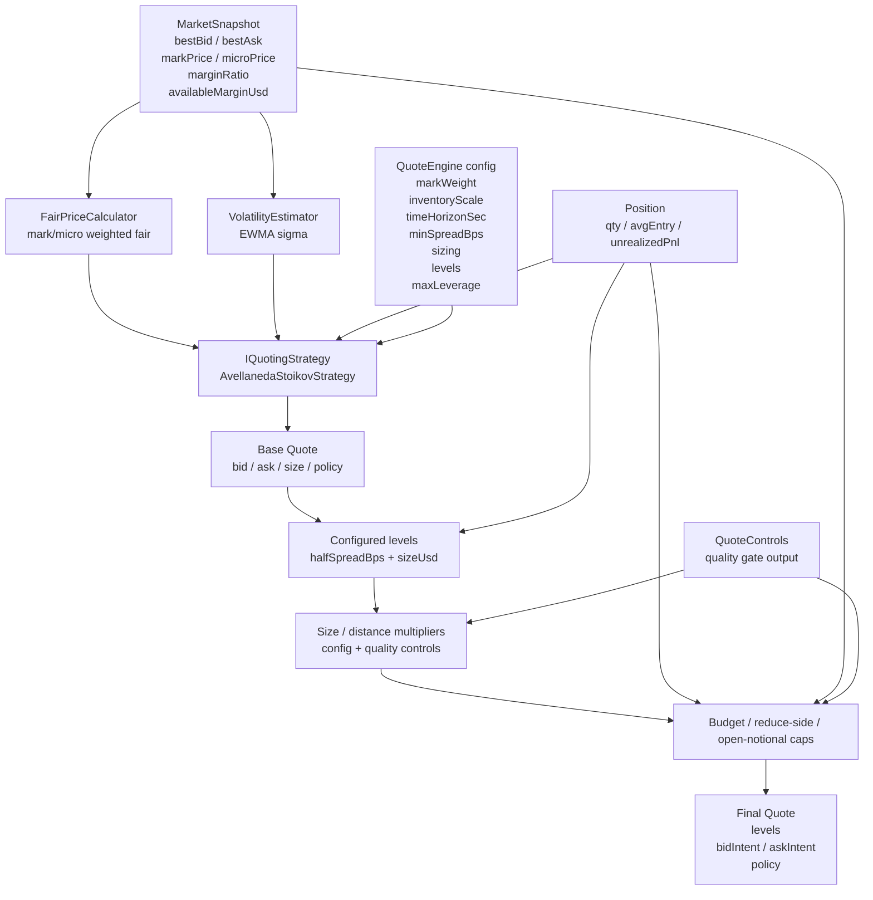
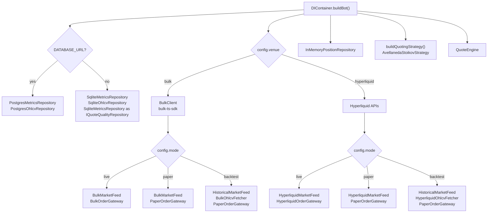
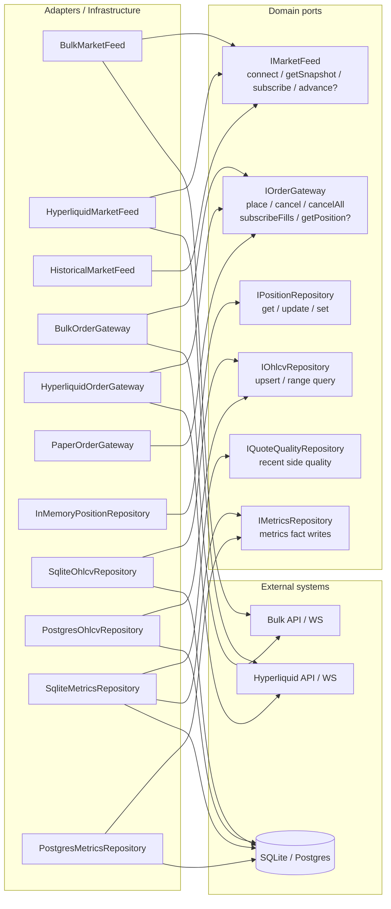
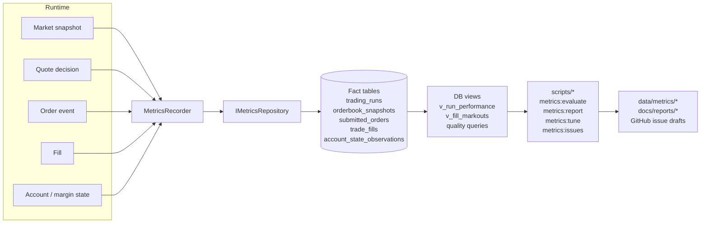
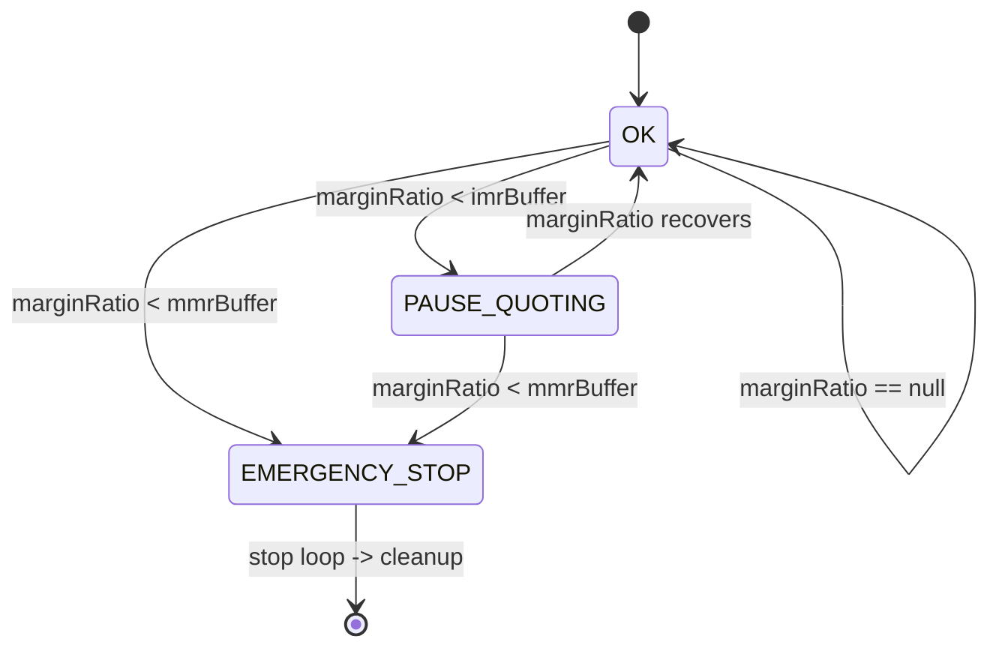
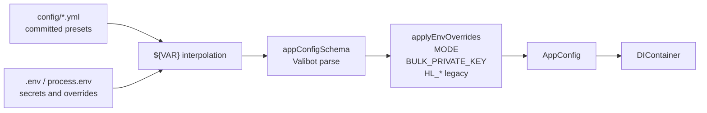

# ARCHITECTURE

`simple-mm-bot` の現在の依存関係、レイヤー責務、1 tick の実行順を図で把握するためのドキュメント。

詳細なディレクトリ責務は [STRUCTURE.md](./STRUCTURE.md)、技術方針は [TECH.md](./TECH.md)、要件は [PRD.md](./PRD.md) を参照。

主対象 venue は **Bulk Trade**。runtime は **Bun + TypeScript**、中心 strategy は **Avellaneda-Stoikov**。

---

## 1. 設計原則

この repo の trading runtime は Clean Architecture で整理する。

- `src/domain/` は純粋な market making logic と port contract。venue SDK、DB、env、logger、runtime validation library を import しない。
- `src/application/` は runtime orchestration。tick loop、use case、DI、order reconcile、metrics recording を担当する。
- `src/adapters/` は venue / mode の protocol 変換。Bulk / Hyperliquid / paper を domain port に合わせる。
- `src/infrastructure/` は storage や runtime metadata。SQLite / Postgres repository、git metadata を置く。
- `src/lib/reporting/` と `scripts/` は bot の外側の分析・可視化・tuning tool。runtime の意思決定に混ぜない。

依存方向は **外側から内側へ**。内側の domain は外側の都合を知らない。この境界は `vite.config.ts` の `no-restricted-imports` で lint enforcement する。

---

## 2. 全体依存図

読み方:

- `DIContainer` だけが「どの venue / mode / DB 実装を使うか」を知る。
- `Bot` と use case は `IMarketFeed` / `IOrderGateway` などの port だけを見る。
- `QuoteEngine` は strategy interface にだけ依存し、Avellaneda-Stoikov の具象生成は `QuotingStrategyFactory` に閉じる。
- `MetricsRecorder` は runtime から fact を保存するだけ。評価結果や report は DB view / reporting tool 側で作る。

---

## 3. レイヤー責務

| Layer             | 主な責務                                                                                         | 依存可能先                                           | 代表ファイル                                                                                                       |
| ----------------- | ------------------------------------------------------------------------------------------------ | ---------------------------------------------------- | ------------------------------------------------------------------------------------------------------------------ |
| Domain            | quote 計算、strategy、fair price、volatility、quote quality control、entity、port、fact contract | domain 内のみ                                        | `src/domain/QuoteEngine.ts`, `src/domain/strategy/*`, `src/domain/ports/*`                                         |
| Application       | bot lifecycle、tick 順序、use case orchestration、DI、order reconcile、metrics fact recording    | domain。`src/application/di.ts` のみ外側を組み立てる | `src/application/Bot.ts`, `src/application/usecases/*`, `src/application/di.ts`, `src/application/OrderManager.ts` |
| Adapters          | Bulk / Hyperliquid / paper の外部 protocol を domain port へ変換                                 | domain ports、venue SDK / local replay               | `src/adapters/bulk/*`, `src/adapters/hyperliquid/*`, `src/adapters/paper/*`                                        |
| Infrastructure    | DB client、schema、domain port 実装、git metadata                                                | domain ports、storage library                        | `src/infrastructure/*`, `src/infrastructure/db/*`                                                                  |
| Tools / Reporting | 保存済み metrics の評価、report 生成、config tuning、issue planning                              | source runtime から分離                              | `scripts/*`, `src/lib/reporting/*`                                                                                 |

### Lint-Enforced Dependency Matrix

`vite.config.ts` の lint rule は次を落とす。

| Scope                   | 禁止 import                                                                                                                | 例外                                                               |
| ----------------------- | -------------------------------------------------------------------------------------------------------------------------- | ------------------------------------------------------------------ |
| all source layers       | `zod`                                                                                                                      | なし。runtime validation は `valibot` に統一する                   |
| `src/domain/**`         | `application` / `adapters` / `infrastructure` / `lib` / `config` / `env` / `utils` / `valibot` / DB / SDK / Node built-ins | domain 内 import のみ                                              |
| `src/application/**`    | `adapters` / `infrastructure` / `lib`                                                                                      | `src/application/di.ts` は composition root として具象を組み立てる |
| `src/adapters/**`       | `application` / `infrastructure`                                                                                           | domain port と venue SDK / local replay は許可                     |
| `src/infrastructure/**` | `application` / `adapters`                                                                                                 | domain port の実装として domain import は許可                      |
| `src/lib/**`            | runtime layers                                                                                                             | reporting / helper logic を bot runtime へ混ぜない                 |

Validation 責務:

- `src/env.ts` と `src/config.ts` だけが Valibot schema を持つ。
- domain strategy parameter file は pure type のみ。`AvellanedaStoikovParams` の制約は config validation 側で検証する。
- `@t3-oss/env-core` は Valibot schema で env を検証し、空文字は `undefined` として扱う。

---

## 4. 主要クラスの責務

| Component                   | 責務                                                                                                          | 持たない責務                         |
| --------------------------- | ------------------------------------------------------------------------------------------------------------- | ------------------------------------ |
| `main.ts`                   | config load、DI build、shutdown handler 登録、`Bot.start()` 呼び出し                                          | venue 分岐、注文判断、DB 操作        |
| `DIContainer`               | venue × mode × DB の具象解決、use case と adapter の組み立て                                                  | tick 実行、trading 判断              |
| `Bot`                       | 起動・接続・購読・tick loop・cleanup、event task drain                                                        | quote price 計算、venue payload 生成 |
| `GuardRiskUseCase`          | snapshot の margin / risk state を `OK` / `PAUSE_QUOTING` / `EMERGENCY_STOP` に分類                           | 注文発行                             |
| `RefreshQuotesUseCase`      | snapshot / position / quote quality から quote を作り、target orders を `OrderManager` に渡す                 | venue SDK 直接操作、strategy 実装    |
| `OrderManager`              | 前回 quote と今回 target の差分 reconcile、必要な cancel / replace / reuse                                    | quote 価格計算、risk 判定            |
| `ReduceInventoryUseCase`    | inventory / loss / adverse move が閾値を超えた時に reduce-only order を出す                                   | 通常 quote の維持                    |
| `ClosePositionUseCase`      | shutdown / emergency 時の position flatten                                                                    | tick 中の quoting                    |
| `MetricsRecorder`           | run metadata、orderbook snapshot、submitted order、fill、account state を fact として保存                     | PnL 判断、report 生成                |
| `QuoteEngine`               | fair price、sigma、strategy output、ladder、size/distance multiplier、budget/notional cap、side intent を合成 | venue / mode / DB の知識             |
| `AvellanedaStoikovStrategy` | spread と inventory skew から top quote を計算                                                                | ladder、budget cap、adapter payload  |
| `BulkMarketFeed`            | Bulk HTTP / WS から snapshot、OHLCV、margin/position freshness を正規化                                       | order placement                      |
| `BulkOrderGateway`          | domain order を Bulk order API に変換し、fills / order events を domain に正規化                              | quote generation                     |
| `PaperOrderGateway`         | live order を送らず paper fill を simulation                                                                  | market data fetch                    |
| `HistoricalMarketFeed`      | OHLCV repository / fetcher から時系列 replay                                                                  | execution simulation                 |

---

## 5. 1 Tick の流れ

現在の `Bot.runTick()` は、risk check、event drain、inventory reduction、quote refresh、historical feed advance の順で動く。

重要な分岐:

- `PAUSE_QUOTING` は新規 quote を出さないが、event drain と inventory reduction は動く。
- `ReduceInventoryUseCase` が注文した tick では `RefreshQuotesUseCase` をスキップする。
- `RefreshQuotesUseCase` は通常 tick で blanket `cancelAll()` しない。`OrderManager` が差分 cancel / replace を行う。
- `OrderManager` が cancel 失敗で注文状態を信頼できない場合だけ、unknown state として `cancelAll()` に倒す。

---

## 6. 起動から購読まで

Fill / order event は tick と同期実行せず、`Bot` の event task queue に積まれる。各 tick の前半で drain され、position と metrics の鮮度をそろえる。

---

## 7. QuoteEngine 内部

`QuoteEngine` は strategy output をそのまま返すだけではなく、現在は複数の post-processing を合成する中心点になっている。

処理順の要点:

1. `FairPriceCalculator` が mark / micro price から fair price を作る。
2. `VolatilityEstimator` が mark price の EWMA volatility を更新する。
3. `IQuotingStrategy` が base bid / ask / size / policy を作る。
4. `quoteEngine.levels` がある場合、ladder quote に展開する。
5. config / quality gate の size・distance multiplier を適用する。
6. position 方向に応じて open / reduce intent を付け、reduce side の qty を現在 position 量までに制限する。
7. `budgetUsd` と Bulk `availableMarginUsd * maxLeverage` から open notional を cap する。

---

## 8. Venue × Mode × DB 解決

`DIContainer` が具象 adapter と repository を選ぶ。application use case は mode / venue branch を持たない。

| venue         | mode       | MarketFeed                                         | OrderGateway              | 主用途                                 |
| ------------- | ---------- | -------------------------------------------------- | ------------------------- | -------------------------------------- |
| `bulk`        | `live`     | `BulkMarketFeed`                                   | `BulkOrderGateway`        | primary live。`BULK_PRIVATE_KEY` 必須  |
| `bulk`        | `paper`    | `BulkMarketFeed`                                   | `PaperOrderGateway`       | live market data + simulated execution |
| `bulk`        | `backtest` | `HistoricalMarketFeed` + `BulkOhlcvFetcher`        | `PaperOrderGateway`       | Bulk OHLCV replay                      |
| `hyperliquid` | `live`     | `HyperliquidMarketFeed`                            | `HyperliquidOrderGateway` | legacy compatibility                   |
| `hyperliquid` | `paper`    | `HyperliquidMarketFeed`                            | `PaperOrderGateway`       | legacy compatibility                   |
| `hyperliquid` | `backtest` | `HistoricalMarketFeed` + `HyperliquidOhlcvFetcher` | `PaperOrderGateway`       | legacy backtest                        |

DB 解決:

- `DATABASE_URL` があれば Postgres。
- なければ SQLite。既定 path は `DB_PATH` / `src/env.ts` 経由で `data/mm.db`。
- SQLite metrics repository は `IQuoteQualityRepository` も実装し、quality gate の markout feedback に使われる。

---

## 9. Ports & Adapters

Port の使い分け:

- market data は `IMarketFeed`。live / paper は subscribe、backtest は `advance()` で replay する。
- execution は `IOrderGateway`。live adapter は venue API、paper adapter は simulation。
- position は tick loop 中は `InMemoryPositionRepository`。startup と fill event で更新する。
- OHLCV は backtest replay と candle cache 用。live performance 評価は orderbook / fill facts を使う。
- quote quality は保存済み fill markout から side ごとの control signal を作る。
- metrics fact は `IMetricsRepository` と fact 型を `src/domain/ports/IMetricsRepository.ts` に置き、SQLite / Postgres が実装する。

---

## 10. Metrics / Analysis Data Flow

runtime は「後から検証できる fact」だけを保存する。評価や report は保存済み fact / view から作る。

実装上の境界:

- `MetricsRecorder` は application にあるが、保存先の interface は `IMetricsRepository`。
- `src/domain/ports/IMetricsRepository.ts` は fact 型と metrics repository contract。
- `SqliteMetricsRepository` / `PostgresMetricsRepository` が DB schema に変換する。
- `src/lib/reporting/*` と `scripts/*` は保存済みデータから成果物を作るだけで、runtime quote 判断へ import しない。

---

## 11. Risk State

挙動:

- `OK`: quote refresh 可能。
- `PAUSE_QUOTING`: quote refresh はスキップ。event drain と inventory reduction は継続。
- `EMERGENCY_STOP`: tick loop を止め、cleanup で `cancelAll()`。`shutdown.closePositionPolicy` が `emergency_only` でも close position を実行する。

---

## 12. Config / Secret Flow

現在の主要 env:

- `CONFIG_PATH`: 読み込む YAML。default は `config/config.bulk.beta.yml`。
- `MODE`: `live` / `paper` / `backtest` override。
- `DATABASE_URL`: あれば Postgres、なければ SQLite。
- `DB_PATH`: SQLite path。default は `data/mm.db`。
- `BULK_PRIVATE_KEY`: Bulk live order placement 用。
- `LOG_LEVEL`: repo logger の filter。
- `HL_*`: Hyperliquid legacy path 用。

secret env は `src/env.ts` と config override 以外から直接読まない。

---

## 13. 変更時のチェックリスト

- [ ] `src/domain/**` が `application` / `adapters` / `infrastructure` / `utils` を import していない。
- [ ] Bulk API / SDK 型は `src/adapters/bulk/**` と `bulk-ts-sdk` 境界に閉じている。
- [ ] 新規 strategy は `IQuotingStrategy` 実装 + config schema + `QuotingStrategyFactory` の変更で足りる。
- [ ] 新規 venue は `src/adapters/<venue>/` + `DIContainer` の分岐追加で足りる。
- [ ] `Bot` の tick 順序を変える時は、risk state、event drain、inventory reduction、quote refresh、cleanup の相互作用を更新する。
- [ ] 通常 tick の quote 更新で blanket `cancelAll()` を増やさない。必要な場合は `OrderManager` の unknown-state fallback として扱う。
- [ ] runtime は fact を保存し、評価結果は DB view / scripts / reporting 側で作る。
- [ ] `scripts/*` や `src/lib/reporting/*` の分析 logic を runtime quote 判断に import しない。
