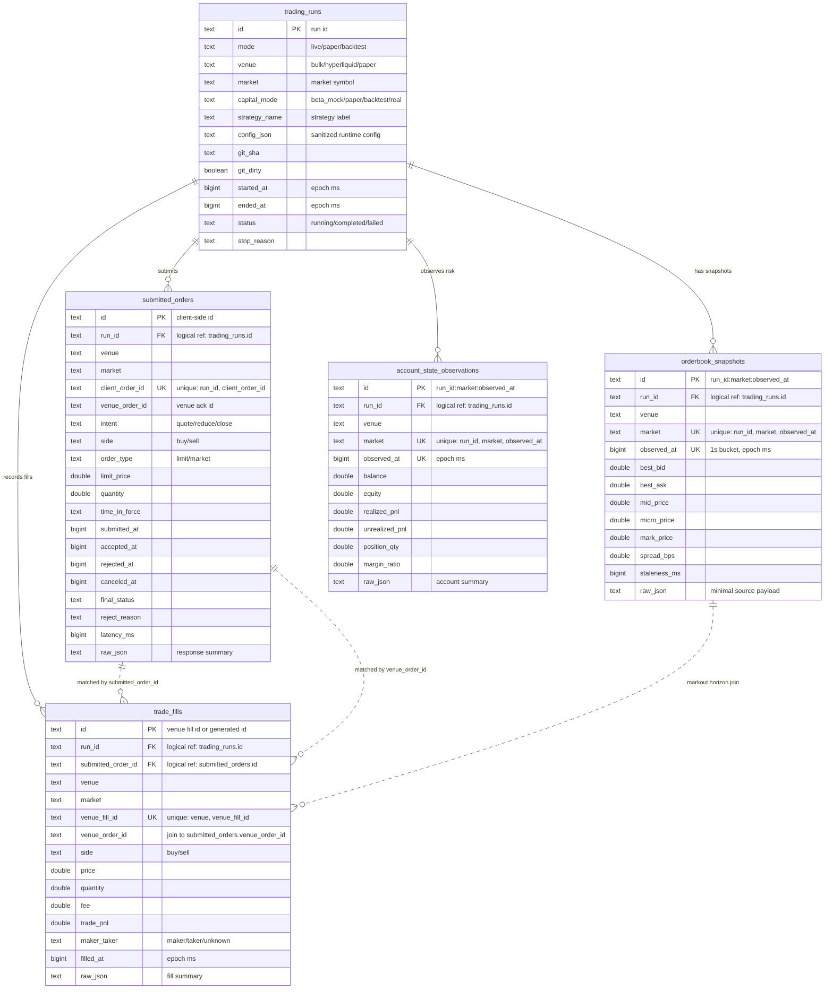

# Database

SQLite / PostgreSQL の metrics DB は、後から評価できる fact だけを保存する。
分析結果は table に保存せず、SQL view で計算する。

参照元:

- SQLite schema: `src/infrastructure/db/sqlite/schema.ts`
- SQLite runtime DDL: `src/infrastructure/db/sqlite/client.ts`
- PostgreSQL schema: `src/infrastructure/db/postgres/schema.ts`
- PostgreSQL migrations: `src/infrastructure/db/postgres/migrations/`

## Core Metrics Tables

| Table                        | 用途                              | Primary / unique key                            |
| ---------------------------- | --------------------------------- | ----------------------------------------------- |
| `trading_runs`               | run 単位の分析軸                  | `id`                                            |
| `orderbook_snapshots`        | spread、staleness、markout join   | PK `id`, unique `(run_id, market, observed_at)` |
| `submitted_orders`           | 注文品質、reject/cancel/fill rate | PK `id`, unique `(run_id, client_order_id)`     |
| `trade_fills`                | PnL、fee、volume、fill 品質       | PK `id`, unique `(venue, venue_fill_id)`        |
| `account_state_observations` | inventory、margin、equity risk    | PK `id`, unique `(run_id, market, observed_at)` |

`telemetry_events`, `markouts`, `quote_decisions`, `runtime_incidents` は core metrics DB には作らない。
Markout や run performance は保存済み fact から view で計算する。

既存の `fills` と `ohlcv` は legacy / historical path 用に残っている。
`reports` table は作らない。run 評価の入口は `trade_fills` と metrics views。

## ER Diagram

DB 上の外部キーは定義していない。以下の関係は `run_id`、`submitted_order_id`、
`venue_order_id` による論理関係を示す。

## Table Columns

型は論理型で記載する。SQLite では timestamp は `INTEGER`、PostgreSQL では `BIGINT`。
SQLite の boolean は `INTEGER` として保存される。

### `trading_runs`

| Column          | Type      | Null | Key | 用途                                             |
| --------------- | --------- | ---- | --- | ------------------------------------------------ |
| `id`            | `text`    | no   | PK  | run 集約キー                                     |
| `mode`          | `text`    | no   | -   | `live` / `paper` / `backtest` 比較               |
| `venue`         | `text`    | no   | -   | venue 別比較                                     |
| `market`        | `text`    | no   | -   | market 別比較                                    |
| `capital_mode`  | `text`    | no   | -   | `beta_mock` / `paper` / `backtest` / `real` 比較 |
| `strategy_name` | `text`    | no   | -   | strategy 別比較                                  |
| `config_json`   | `text`    | no   | -   | sanitized config snapshot                        |
| `git_sha`       | `text`    | yes  | -   | 実装 version                                     |
| `git_dirty`     | `boolean` | no   | -   | dirty worktree flag                              |
| `started_at`    | `bigint`  | no   | -   | run 開始時刻 epoch ms                            |
| `ended_at`      | `bigint`  | yes  | -   | run 終了時刻 epoch ms                            |
| `status`        | `text`    | no   | -   | `running` / `completed` / `failed`               |
| `stop_reason`   | `text`    | yes  | -   | 停止理由                                         |

### `orderbook_snapshots`

| Column         | Type     | Null | Key     | 用途                            |
| -------------- | -------- | ---- | ------- | ------------------------------- |
| `id`           | `text`   | no   | PK      | row id                          |
| `run_id`       | `text`   | no   | UK part | run 別 market condition         |
| `venue`        | `text`   | no   | -       | venue 別分析                    |
| `market`       | `text`   | no   | UK part | market 別分析                   |
| `observed_at`  | `bigint` | no   | UK part | 1 秒 bucket timestamp           |
| `best_bid`     | `double` | no   | -       | spread / execution comparison   |
| `best_ask`     | `double` | no   | -       | spread / execution comparison   |
| `mid_price`    | `double` | no   | -       | markout / fair price basis      |
| `micro_price`  | `double` | no   | -       | imbalance-aware fair price      |
| `mark_price`   | `double` | no   | -       | markout / paper-live comparison |
| `spread_bps`   | `double` | no   | -       | market quality                  |
| `staleness_ms` | `bigint` | no   | -       | stale feed rate                 |
| `raw_json`     | `text`   | yes  | -       | minimal source payload          |

Unique: `(run_id, market, observed_at)`.

### `submitted_orders`

| Column            | Type     | Null | Key     | 用途                                                |
| ----------------- | -------- | ---- | ------- | --------------------------------------------------- |
| `id`              | `text`   | no   | PK      | client-side submitted order id                      |
| `run_id`          | `text`   | no   | UK part | run 別 order quality                                |
| `venue`           | `text`   | no   | -       | venue 別分析                                        |
| `market`          | `text`   | no   | -       | market 別分析                                       |
| `client_order_id` | `text`   | no   | UK part | submit tracking / duplicate prevention              |
| `venue_order_id`  | `text`   | yes  | -       | venue ack id / fill join                            |
| `intent`          | `text`   | no   | -       | `quote` / `reduce` / `close`                        |
| `side`            | `text`   | no   | -       | `buy` / `sell`                                      |
| `order_type`      | `text`   | no   | -       | `limit` / `market`                                  |
| `limit_price`     | `double` | yes  | -       | quote aggressiveness                                |
| `quantity`        | `double` | no   | -       | order size                                          |
| `time_in_force`   | `text`   | no   | -       | TIF 別分析                                          |
| `submitted_at`    | `bigint` | no   | -       | submit timestamp                                    |
| `accepted_at`     | `bigint` | yes  | -       | ack timestamp                                       |
| `rejected_at`     | `bigint` | yes  | -       | reject timestamp                                    |
| `canceled_at`     | `bigint` | yes  | -       | cancel timestamp                                    |
| `final_status`    | `text`   | no   | -       | submitted / accepted / rejected / canceled / filled |
| `reject_reason`   | `text`   | yes  | -       | reject cause                                        |
| `latency_ms`      | `bigint` | yes  | -       | submit-to-ack/reject latency                        |
| `raw_json`        | `text`   | yes  | -       | response summary                                    |

Unique: `(run_id, client_order_id)`.

### `trade_fills`

| Column               | Type     | Null | Key     | 用途                            |
| -------------------- | -------- | ---- | ------- | ------------------------------- |
| `id`                 | `text`   | no   | PK      | row id                          |
| `run_id`             | `text`   | no   | -       | run 別 PnL / fill 分析          |
| `submitted_order_id` | `text`   | yes  | -       | order-to-fill join              |
| `venue`              | `text`   | no   | UK part | venue 別分析                    |
| `market`             | `text`   | no   | -       | market 別分析                   |
| `venue_fill_id`      | `text`   | no   | UK part | duplicate prevention            |
| `venue_order_id`     | `text`   | yes  | -       | submitted order join            |
| `side`               | `text`   | no   | -       | buy/sell 別 markout / inventory |
| `price`              | `double` | no   | -       | execution price                 |
| `quantity`           | `double` | no   | -       | executed quantity               |
| `fee`                | `double` | no   | -       | net PnL                         |
| `trade_pnl`          | `double` | no   | -       | realized PnL                    |
| `maker_taker`        | `text`   | no   | -       | maker ratio / fee quality       |
| `filled_at`          | `bigint` | no   | -       | fill timestamp                  |
| `raw_json`           | `text`   | yes  | -       | fill summary                    |

Unique: `(venue, venue_fill_id)`.

### `account_state_observations`

| Column           | Type     | Null | Key     | 用途                   |
| ---------------- | -------- | ---- | ------- | ---------------------- |
| `id`             | `text`   | no   | PK      | row id                 |
| `run_id`         | `text`   | no   | UK part | run 別 risk 分析       |
| `venue`          | `text`   | no   | -       | venue 別 risk          |
| `market`         | `text`   | no   | UK part | market 別 risk         |
| `observed_at`    | `bigint` | no   | UK part | observation timestamp  |
| `balance`        | `double` | yes  | -       | capital usage          |
| `equity`         | `double` | yes  | -       | equity drawdown        |
| `realized_pnl`   | `double` | yes  | -       | account-side PnL check |
| `unrealized_pnl` | `double` | yes  | -       | inventory risk         |
| `position_qty`   | `double` | yes  | -       | max inventory / skew   |
| `margin_ratio`   | `double` | yes  | -       | margin risk            |
| `raw_json`       | `text`   | yes  | -       | account summary        |

Unique: `(run_id, market, observed_at)`.

## Fact Sources

| Table                        | 保存タイミング                                                                                                                                                                          |
| ---------------------------- | --------------------------------------------------------------------------------------------------------------------------------------------------------------------------------------- |
| `trading_runs`               | `Bot.start()` で UUID を発行し、mode / venue / market / capital mode / strategy / sanitized config / git metadata を保存する。終了時に `ended_at`, `status`, `stop_reason` を更新する。 |
| `orderbook_snapshots`        | market snapshot を 1 秒 bucket に丸め、top-of-book, mid, micro price, mark price, spread, staleness を upsert する。                                                                    |
| `submitted_orders`           | order gateway の submit / ack / reject / cancel event から client order id 単位で upsert する。                                                                                         |
| `trade_fills`                | `syncFills()` / fill subscription 由来の normalized fill を `(venue, venue_fill_id)` で upsert する。                                                                                   |
| `account_state_observations` | snapshot に account risk 情報がある場合、低頻度 risk observation として保存する。                                                                                                       |

## Analysis Views

| View                | 内容                                                                                            |
| ------------------- | ----------------------------------------------------------------------------------------------- |
| `v_run_pnl`         | notional, fee, trade PnL, net PnL, PnL per notional                                             |
| `v_equity_curve`    | fill 順の cumulative net PnL                                                                    |
| `v_run_drawdown`    | equity curve から max drawdown                                                                  |
| `v_order_quality`   | submit 数、reject rate、cancel rate、fill rate、avg latency                                     |
| `v_fill_markouts`   | `trade_fills` と `orderbook_snapshots` を `filled_at + 5s/30s/300s` で join した signed markout |
| `v_markout_quality` | avg markout、adverse selection rate、markout coverage                                           |
| `v_market_quality`  | avg/p95 spread、stale rate、observation count                                                   |
| `v_inventory_risk`  | max abs position、avg position、min margin ratio、equity drawdown                               |
| `v_run_performance` | run 単位の最終評価入口                                                                          |

`v_fill_markouts` は OHLCV を参照しない。Markout の価格 fact は `orderbook_snapshots` から取る。

## View Columns

### `v_run_pnl`

| Column             | Type     | 内容                     |
| ------------------ | -------- | ------------------------ |
| `run_id`           | `text`   | run id                   |
| `notional`         | `double` | `SUM(price * quantity)`  |
| `fee`              | `double` | total fee                |
| `trade_pnl`        | `double` | total realized trade PnL |
| `net_pnl`          | `double` | `trade_pnl - fee`        |
| `pnl_per_notional` | `double` | `net_pnl / notional`     |

### `v_equity_curve`

| Column               | Type     | 内容                         |
| -------------------- | -------- | ---------------------------- |
| `fill_id`            | `text`   | fill id                      |
| `run_id`             | `text`   | run id                       |
| `filled_at`          | `bigint` | fill timestamp               |
| `cumulative_net_pnl` | `double` | fill 順の cumulative net PnL |

### `v_run_drawdown`

| Column         | Type     | 内容                                    |
| -------------- | -------- | --------------------------------------- |
| `run_id`       | `text`   | run id                                  |
| `max_drawdown` | `double` | equity curve の peak-to-trough drawdown |

### `v_order_quality`

| Column            | Type      | 内容                                 |
| ----------------- | --------- | ------------------------------------ |
| `run_id`          | `text`    | run id                               |
| `submitted_count` | `integer` | submitted order count                |
| `reject_rate`     | `double`  | rejected / submitted                 |
| `cancel_rate`     | `double`  | canceled / submitted                 |
| `fill_rate`       | `double`  | filled / submitted                   |
| `avg_latency_ms`  | `double`  | average submit-to-ack/reject latency |

### `v_fill_markouts`

| Column             | Type      | 内容                            |
| ------------------ | --------- | ------------------------------- |
| `fill_id`          | `text`    | fill id                         |
| `run_id`           | `text`    | run id                          |
| `market`           | `text`    | market                          |
| `side`             | `text`    | buy/sell                        |
| `price`            | `double`  | fill price                      |
| `filled_at`        | `bigint`  | fill timestamp                  |
| `mid_5s`           | `double`  | `filled_at + 5s` の mid price   |
| `markout_5s_bps`   | `double`  | signed 5s markout bps           |
| `adverse_5s`       | `integer` | 5s markout が adverse なら 1    |
| `mid_30s`          | `double`  | `filled_at + 30s` の mid price  |
| `markout_30s_bps`  | `double`  | signed 30s markout bps          |
| `mid_300s`         | `double`  | `filled_at + 300s` の mid price |
| `markout_300s_bps` | `double`  | signed 300s markout bps         |

### `v_markout_quality`

| Column                      | Type     | 内容                               |
| --------------------------- | -------- | ---------------------------------- |
| `run_id`                    | `text`   | run id                             |
| `avg_markout_5s_bps`        | `double` | average 5s markout                 |
| `adverse_selection_rate_5s` | `double` | adverse 5s markout ratio           |
| `markout_5s_coverage`       | `double` | 5s markout が計算できた fill ratio |

### `v_market_quality`

| Column              | Type      | 内容                         |
| ------------------- | --------- | ---------------------------- |
| `run_id`            | `text`    | run id                       |
| `market`            | `text`    | market                       |
| `avg_spread_bps`    | `double`  | average spread               |
| `p95_spread_bps`    | `double`  | spread の p95                |
| `stale_rate`        | `double`  | `staleness_ms > 1000` の比率 |
| `observation_count` | `integer` | orderbook snapshot count     |

### `v_inventory_risk`

| Column             | Type     | 内容                                   |
| ------------------ | -------- | -------------------------------------- |
| `run_id`           | `text`   | run id                                 |
| `max_abs_position` | `double` | max `ABS(position_qty)`                |
| `avg_position`     | `double` | average position                       |
| `min_margin_ratio` | `double` | minimum margin ratio                   |
| `equity_drawdown`  | `double` | account equity peak-to-trough drawdown |

### `v_run_performance`

| Column                      | Type      | 内容                     |
| --------------------------- | --------- | ------------------------ |
| `run_id`                    | `text`    | run id                   |
| `mode`                      | `text`    | runtime mode             |
| `venue`                     | `text`    | venue                    |
| `market`                    | `text`    | market                   |
| `capital_mode`              | `text`    | capital mode             |
| `strategy_name`             | `text`    | strategy                 |
| `started_at`                | `bigint`  | run start                |
| `ended_at`                  | `bigint`  | run end                  |
| `status`                    | `text`    | run status               |
| `notional`                  | `double`  | from `v_run_pnl`         |
| `fee`                       | `double`  | from `v_run_pnl`         |
| `trade_pnl`                 | `double`  | from `v_run_pnl`         |
| `net_pnl`                   | `double`  | from `v_run_pnl`         |
| `pnl_per_notional`          | `double`  | from `v_run_pnl`         |
| `max_drawdown`              | `double`  | from `v_run_drawdown`    |
| `submitted_count`           | `integer` | from `v_order_quality`   |
| `reject_rate`               | `double`  | from `v_order_quality`   |
| `cancel_rate`               | `double`  | from `v_order_quality`   |
| `fill_rate`                 | `double`  | from `v_order_quality`   |
| `avg_latency_ms`            | `double`  | from `v_order_quality`   |
| `avg_markout_5s_bps`        | `double`  | from `v_markout_quality` |
| `adverse_selection_rate_5s` | `double`  | from `v_markout_quality` |
| `markout_5s_coverage`       | `double`  | from `v_markout_quality` |
| `avg_spread_bps`            | `double`  | from `v_market_quality`  |
| `p95_spread_bps`            | `double`  | from `v_market_quality`  |
| `stale_rate`                | `double`  | from `v_market_quality`  |
| `max_abs_position`          | `double`  | from `v_inventory_risk`  |
| `avg_position`              | `double`  | from `v_inventory_risk`  |
| `min_margin_ratio`          | `double`  | from `v_inventory_risk`  |
| `equity_drawdown`           | `double`  | from `v_inventory_risk`  |

## OHLCV Policy

Bulk live / paper の成績評価には OHLCV を使わない。
評価に必要な価格 fact は `orderbook_snapshots` に保存する。

OHLCV は backtest / historical cache、または venue candle をそのまま残したい reporting path 用の別枠として扱う。
top-of-book や ticker だけの snapshot から volume=0 candle は作らない。
