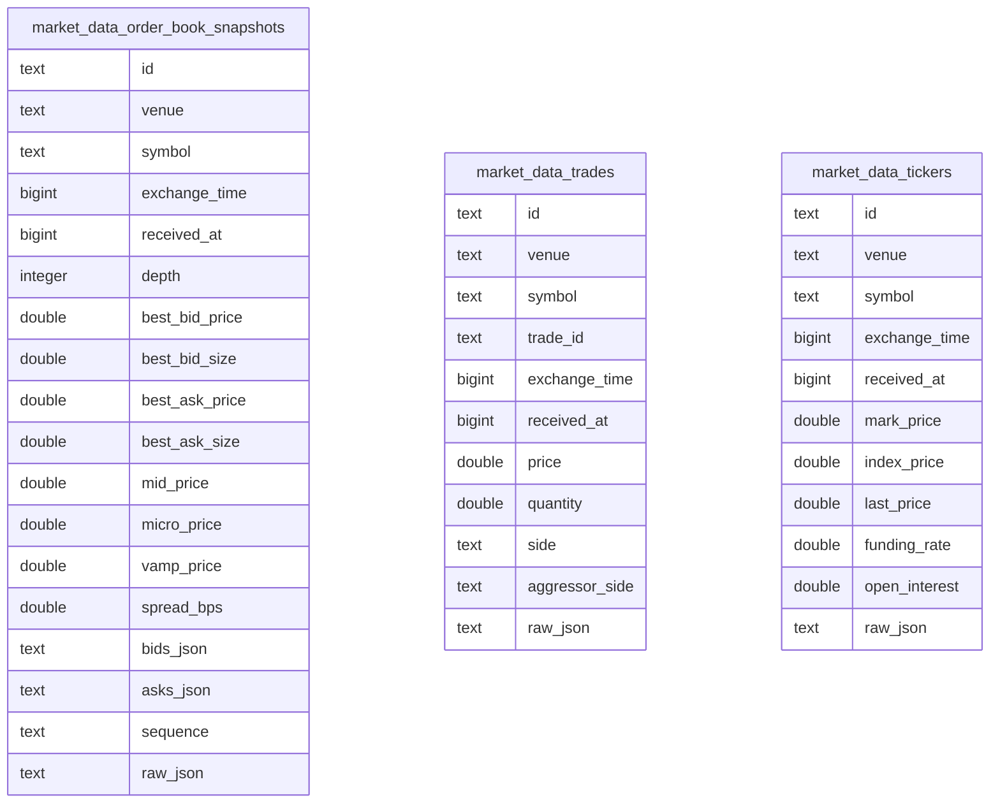

# Database

`simple-mm-bot` uses PostgreSQL with TimescaleDB as the primary runtime database.
The local repository only keeps the Docker PGDATA volume under `data/timescaledb/`.
Venue market facts and bot execution facts are stored separately.

## Database 一覧

| DB            | Path / URL                | Owner                           | 内容                                                               |
| ------------- | ------------------------- | ------------------------------- | ------------------------------------------------------------------ |
| Primary DB    | `postgresql://.../mm_bot` | bot runtime, recorder, backtest | TimescaleDB/PostgreSQL primary store for market data and bot facts |
| Docker volume | `data/timescaledb/`       | `docker compose` `timescaledb`  | Local PGDATA for the development TimescaleDB container             |
| Analytics     | `analytics_*` SQL views   | PostgreSQL view definitions     | Markout views derived from `market_data_*` and `bot_*` fact tables |

`DATABASE_URL` must start with `postgres://` or `postgresql://`.
All time columns are epoch milliseconds stored as `BIGINT`.

## Folder Structure

```text
data/
  timescaledb/
    pgdata/
```

The recorder and bot write runtime facts to TimescaleDB, not to repository-local
database files. Generated reports or temporary analysis outputs may be created
under `data/` by explicit scripts, but they are not part of the canonical DB
layout.

## Market Data Table Roles

| Table                              | Writer                      | Time column   | Role                                                         |
| ---------------------------------- | --------------------------- | ------------- | ------------------------------------------------------------ |
| `market_data_order_book_snapshots` | market-data recorder worker | `received_at` | Venue L2 order book snapshots normalized for replay/markouts |
| `market_data_trades`               | market-data recorder worker | `received_at` | Venue public trade prints                                    |
| `market_data_tickers`              | market-data recorder worker | `received_at` | Mark/index/last/funding/open-interest facts when available   |

The market-data recorder writes only `market_data_*` rows. It must not write
`bot_*` execution rows.

## Table Details

### `market_data_order_book_snapshots`

Venue L2 book snapshots observed by the recorder.

| Column           | Type               | Null | Default | Description                                                                |
| ---------------- | ------------------ | ---- | ------- | -------------------------------------------------------------------------- |
| `id`             | `TEXT`             | No   | -       | Recorder-generated snapshot id. Unique with `received_at` for TimescaleDB. |
| `venue`          | `TEXT`             | No   | -       | Recorder venue, for example `bulk`.                                        |
| `symbol`         | `TEXT`             | No   | -       | Venue symbol, for example `BTC-USD`.                                       |
| `exchange_time`  | `BIGINT`           | Yes  | -       | Venue-provided event time in epoch milliseconds when available.            |
| `received_at`    | `BIGINT`           | No   | -       | Local recorder receive time in epoch milliseconds. Hypertable time column. |
| `depth`          | `INTEGER`          | No   | -       | Number of levels captured per side.                                        |
| `best_bid_price` | `DOUBLE PRECISION` | No   | -       | Top bid price.                                                             |
| `best_bid_size`  | `DOUBLE PRECISION` | No   | -       | Top bid quantity.                                                          |
| `best_ask_price` | `DOUBLE PRECISION` | No   | -       | Top ask price.                                                             |
| `best_ask_size`  | `DOUBLE PRECISION` | No   | -       | Top ask quantity.                                                          |
| `mid_price`      | `DOUBLE PRECISION` | No   | -       | `(best_bid_price + best_ask_price) / 2`.                                   |
| `micro_price`    | `DOUBLE PRECISION` | Yes  | -       | BBO size-weighted microprice when computable.                              |
| `vamp_price`     | `DOUBLE PRECISION` | Yes  | -       | Depth-weighted VAMP price when computable.                                 |
| `spread_bps`     | `DOUBLE PRECISION` | No   | -       | BBO spread in basis points.                                                |
| `bids_json`      | `TEXT`             | No   | -       | JSON string of normalized bid levels.                                      |
| `asks_json`      | `TEXT`             | No   | -       | JSON string of normalized ask levels.                                      |
| `sequence`       | `TEXT`             | Yes  | -       | Venue sequence or update id when available.                                |
| `raw_json`       | `TEXT`             | Yes  | -       | Raw venue payload serialized as JSON when retained.                        |

| Index                                  | Unique | Columns                          | Purpose                                                                                   |
| -------------------------------------- | ------ | -------------------------------- | ----------------------------------------------------------------------------------------- |
| `md_book_id_received_at_idx`           | Yes    | `id`, `received_at`              | Deduplicate snapshots while satisfying TimescaleDB unique-index time-column requirements. |
| `md_book_venue_symbol_received_at_idx` | No     | `venue`, `symbol`, `received_at` | Main replay and markout lookup path by venue, symbol, and time.                           |
| `md_book_symbol_received_at_idx`       | No     | `symbol`, `received_at`          | Symbol-level time scans across venues.                                                    |

### `market_data_trades`

Venue public trade prints observed by the recorder.

| Column           | Type               | Null | Default | Description                                                                 |
| ---------------- | ------------------ | ---- | ------- | --------------------------------------------------------------------------- |
| `id`             | `TEXT`             | No   | -       | Recorder-generated trade row id. Unique with `received_at` for TimescaleDB. |
| `venue`          | `TEXT`             | No   | -       | Recorder venue.                                                             |
| `symbol`         | `TEXT`             | No   | -       | Venue symbol.                                                               |
| `trade_id`       | `TEXT`             | Yes  | -       | Venue-provided trade id when available.                                     |
| `exchange_time`  | `BIGINT`           | Yes  | -       | Venue-provided trade time in epoch milliseconds when available.             |
| `received_at`    | `BIGINT`           | No   | -       | Local recorder receive time in epoch milliseconds. Hypertable time column.  |
| `price`          | `DOUBLE PRECISION` | No   | -       | Trade price.                                                                |
| `quantity`       | `DOUBLE PRECISION` | No   | -       | Trade quantity.                                                             |
| `side`           | `TEXT`             | Yes  | -       | Normalized trade side, usually `buy`, `sell`, or `unknown`.                 |
| `aggressor_side` | `TEXT`             | Yes  | -       | Aggressor side when the venue exposes it.                                   |
| `raw_json`       | `TEXT`             | Yes  | -       | Raw venue payload serialized as JSON when retained.                         |

| Index                                      | Unique | Columns                            | Purpose                                                                                    |
| ------------------------------------------ | ------ | ---------------------------------- | ------------------------------------------------------------------------------------------ |
| `md_trades_id_received_at_idx`             | Yes    | `id`, `received_at`                | Deduplicate trade rows while satisfying TimescaleDB unique-index time-column requirements. |
| `md_trades_venue_symbol_received_at_idx`   | No     | `venue`, `symbol`, `received_at`   | Query trades by venue, symbol, and time.                                                   |
| `md_trades_symbol_received_at_idx`         | No     | `symbol`, `received_at`            | Symbol-level time scans across venues.                                                     |
| `md_trades_venue_trade_id_received_at_idx` | Yes    | `venue`, `trade_id`, `received_at` | Avoid duplicate venue trade ids at the same observed time.                                 |

### `market_data_tickers`

Ticker, mark, index, funding, and open-interest facts observed by the recorder.

| Column          | Type               | Null | Default | Description                                                                  |
| --------------- | ------------------ | ---- | ------- | ---------------------------------------------------------------------------- |
| `id`            | `TEXT`             | No   | -       | Recorder-generated ticker row id. Unique with `received_at` for TimescaleDB. |
| `venue`         | `TEXT`             | No   | -       | Recorder venue.                                                              |
| `symbol`        | `TEXT`             | No   | -       | Venue symbol.                                                                |
| `exchange_time` | `BIGINT`           | Yes  | -       | Venue-provided ticker time in epoch milliseconds when available.             |
| `received_at`   | `BIGINT`           | No   | -       | Local recorder receive time in epoch milliseconds. Hypertable time column.   |
| `mark_price`    | `DOUBLE PRECISION` | Yes  | -       | Venue mark price when available.                                             |
| `index_price`   | `DOUBLE PRECISION` | Yes  | -       | Venue index price when available.                                            |
| `last_price`    | `DOUBLE PRECISION` | Yes  | -       | Last traded price when available.                                            |
| `funding_rate`  | `DOUBLE PRECISION` | Yes  | -       | Current or next funding rate when available.                                 |
| `open_interest` | `DOUBLE PRECISION` | Yes  | -       | Open interest when available.                                                |
| `raw_json`      | `TEXT`             | Yes  | -       | Raw venue payload serialized as JSON when retained.                          |

| Index                                     | Unique | Columns                          | Purpose                                                                                     |
| ----------------------------------------- | ------ | -------------------------------- | ------------------------------------------------------------------------------------------- |
| `md_tickers_id_received_at_idx`           | Yes    | `id`, `received_at`              | Deduplicate ticker rows while satisfying TimescaleDB unique-index time-column requirements. |
| `md_tickers_venue_symbol_received_at_idx` | No     | `venue`, `symbol`, `received_at` | Query tickers by venue, symbol, and time.                                                   |
| `md_tickers_symbol_received_at_idx`       | No     | `symbol`, `received_at`          | Symbol-level time scans across venues.                                                      |

### `bot_runs`

One live, paper, backtest, or replay run.

| Column             | Type      | Null | Default | Description                                                             |
| ------------------ | --------- | ---- | ------- | ----------------------------------------------------------------------- |
| `id`               | `TEXT`    | No   | -       | Run id. Primary key.                                                    |
| `mode`             | `TEXT`    | No   | -       | Runtime mode: `live`, `paper`, `backtest`, or `replay`.                 |
| `venue`            | `TEXT`    | No   | -       | Venue used by the run.                                                  |
| `symbol`           | `TEXT`    | No   | -       | Symbol used by the run.                                                 |
| `strategy_name`    | `TEXT`    | No   | -       | Strategy implementation name.                                           |
| `strategy_version` | `TEXT`    | Yes  | -       | Strategy version when available.                                        |
| `config_hash`      | `TEXT`    | No   | -       | Stable hash of the effective config.                                    |
| `config_json`      | `TEXT`    | No   | -       | Effective run config serialized as JSON.                                |
| `git_sha`          | `TEXT`    | Yes  | -       | Git commit sha when available.                                          |
| `git_dirty`        | `BOOLEAN` | No   | `false` | Whether the worktree was dirty when the run started.                    |
| `started_at`       | `BIGINT`  | No   | -       | Run start time in epoch milliseconds.                                   |
| `ended_at`         | `BIGINT`  | Yes  | -       | Run end time in epoch milliseconds.                                     |
| `status`           | `TEXT`    | No   | -       | Run status, for example `running`, `completed`, `failed`, or `stopped`. |
| `stop_reason`      | `TEXT`    | Yes  | -       | Stop or failure reason.                                                 |
| `metadata_json`    | `TEXT`    | Yes  | -       | Additional run metadata serialized as JSON.                             |

| Index           | Unique | Columns | Purpose                     |
| --------------- | ------ | ------- | --------------------------- |
| `bot_runs_pkey` | Yes    | `id`    | Enforce one row per run id. |

### `bot_market_observations`

What the bot saw and computed before making quote decisions.

| Column                    | Type               | Null | Default | Description                                                       |
| ------------------------- | ------------------ | ---- | ------- | ----------------------------------------------------------------- |
| `id`                      | `TEXT`             | No   | -       | Observation id. Unique with `observed_at` for TimescaleDB.        |
| `run_id`                  | `TEXT`             | No   | -       | Owning bot run id.                                                |
| `observed_at`             | `BIGINT`           | No   | -       | Observation time in epoch milliseconds. Hypertable time column.   |
| `venue`                   | `TEXT`             | No   | -       | Venue observed by the bot.                                        |
| `symbol`                  | `TEXT`             | No   | -       | Symbol observed by the bot.                                       |
| `latest_book_snapshot_id` | `TEXT`             | Yes  | -       | Latest market-data book snapshot id visible to the bot.           |
| `latest_ticker_id`        | `TEXT`             | Yes  | -       | Latest market-data ticker id visible to the bot.                  |
| `latest_trade_id`         | `TEXT`             | Yes  | -       | Latest market-data trade id visible to the bot.                   |
| `local_mid`               | `DOUBLE PRECISION` | Yes  | -       | Bot-local mid price.                                              |
| `local_micro`             | `DOUBLE PRECISION` | Yes  | -       | Bot-local microprice.                                             |
| `local_vamp`              | `DOUBLE PRECISION` | Yes  | -       | Bot-local VAMP price.                                             |
| `mark_price`              | `DOUBLE PRECISION` | Yes  | -       | Mark price used by the bot.                                       |
| `external_fair`           | `DOUBLE PRECISION` | Yes  | -       | External fair value used by the bot when available.               |
| `external_age_ms`         | `BIGINT`           | Yes  | -       | Age of the external fair value in milliseconds.                   |
| `external_diff_bps`       | `DOUBLE PRECISION` | Yes  | -       | Difference between local price and external fair in basis points. |
| `position_qty`            | `DOUBLE PRECISION` | Yes  | -       | Bot position quantity at observation time.                        |
| `inventory_notional`      | `DOUBLE PRECISION` | Yes  | -       | Position notional at observation time.                            |
| `context_json`            | `TEXT`             | Yes  | -       | Additional quote-input context serialized as JSON.                |

| Index                                | Unique | Columns                           | Purpose                                                                                      |
| ------------------------------------ | ------ | --------------------------------- | -------------------------------------------------------------------------------------------- |
| `bot_obs_id_observed_at_idx`         | Yes    | `id`, `observed_at`               | Deduplicate observations while satisfying TimescaleDB unique-index time-column requirements. |
| `bot_obs_run_observed_at_idx`        | No     | `run_id`, `observed_at`           | Read a run's observations in time order.                                                     |
| `bot_obs_run_symbol_observed_at_idx` | No     | `run_id`, `symbol`, `observed_at` | Read symbol-scoped observations for a run.                                                   |

### `bot_quote_decisions`

Quote decisions produced by the strategy and quote engine.

| Column               | Type               | Null | Default | Description                                                  |
| -------------------- | ------------------ | ---- | ------- | ------------------------------------------------------------ |
| `id`                 | `TEXT`             | No   | -       | Quote decision id. Unique with `decided_at` for TimescaleDB. |
| `run_id`             | `TEXT`             | No   | -       | Owning bot run id.                                           |
| `observation_id`     | `TEXT`             | Yes  | -       | Input observation id when linked.                            |
| `decided_at`         | `BIGINT`           | No   | -       | Decision time in epoch milliseconds. Hypertable time column. |
| `quote_cycle_id`     | `TEXT`             | Yes  | -       | Runtime quote cycle id when available.                       |
| `venue`              | `TEXT`             | No   | -       | Venue quoted by the bot.                                     |
| `symbol`             | `TEXT`             | No   | -       | Symbol quoted by the bot.                                    |
| `fair_price`         | `DOUBLE PRECISION` | No   | -       | Fair price used by the quote engine.                         |
| `reservation_price`  | `DOUBLE PRECISION` | Yes  | -       | Inventory-adjusted reservation price.                        |
| `reference_price`    | `DOUBLE PRECISION` | Yes  | -       | Reference price used by the strategy.                        |
| `sigma`              | `DOUBLE PRECISION` | Yes  | -       | Volatility input.                                            |
| `gamma`              | `DOUBLE PRECISION` | Yes  | -       | Risk-aversion input.                                         |
| `kappa`              | `DOUBLE PRECISION` | Yes  | -       | Liquidity or fill-intensity input.                           |
| `inventory_qty`      | `DOUBLE PRECISION` | Yes  | -       | Position quantity used for the decision.                     |
| `inventory_skew_bps` | `DOUBLE PRECISION` | Yes  | -       | Inventory-driven quote skew in basis points.                 |
| `bid_price`          | `DOUBLE PRECISION` | Yes  | -       | Decided bid price when bid quoting is enabled.               |
| `bid_size`           | `DOUBLE PRECISION` | Yes  | -       | Decided bid quantity.                                        |
| `ask_price`          | `DOUBLE PRECISION` | Yes  | -       | Decided ask price when ask quoting is enabled.               |
| `ask_size`           | `DOUBLE PRECISION` | Yes  | -       | Decided ask quantity.                                        |
| `bid_enabled`        | `BOOLEAN`          | No   | `true`  | Whether the bid side was enabled.                            |
| `ask_enabled`        | `BOOLEAN`          | No   | `true`  | Whether the ask side was enabled.                            |
| `spread_bps`         | `DOUBLE PRECISION` | Yes  | -       | Full quoted spread in basis points.                          |
| `half_spread_bps`    | `DOUBLE PRECISION` | Yes  | -       | Half spread in basis points.                                 |
| `reason`             | `TEXT`             | Yes  | -       | Short decision reason or skip reason.                        |
| `decision_json`      | `TEXT`             | Yes  | -       | Full decision diagnostics serialized as JSON.                |

| Index                                  | Unique | Columns                          | Purpose                                                                                   |
| -------------------------------------- | ------ | -------------------------------- | ----------------------------------------------------------------------------------------- |
| `bot_quotes_id_decided_at_idx`         | Yes    | `id`, `decided_at`               | Deduplicate decisions while satisfying TimescaleDB unique-index time-column requirements. |
| `bot_quotes_run_decided_at_idx`        | No     | `run_id`, `decided_at`           | Read quote decisions for a run in time order.                                             |
| `bot_quotes_run_symbol_decided_at_idx` | No     | `run_id`, `symbol`, `decided_at` | Read symbol-scoped decisions for a run.                                                   |

### `bot_orders`

Orders created, submitted, accepted, canceled, rejected, skipped, or filled by the bot.

| Column              | Type               | Null | Default | Description                                                              |
| ------------------- | ------------------ | ---- | ------- | ------------------------------------------------------------------------ |
| `id`                | `TEXT`             | No   | -       | Bot order row id. Unique with `created_at` for TimescaleDB.              |
| `run_id`            | `TEXT`             | No   | -       | Owning bot run id.                                                       |
| `quote_decision_id` | `TEXT`             | Yes  | -       | Quote decision that produced the order when linked.                      |
| `created_at`        | `BIGINT`           | No   | -       | Local order creation time in epoch milliseconds. Hypertable time column. |
| `submitted_at`      | `BIGINT`           | Yes  | -       | Submission time in epoch milliseconds.                                   |
| `accepted_at`       | `BIGINT`           | Yes  | -       | Venue acceptance time in epoch milliseconds.                             |
| `canceled_at`       | `BIGINT`           | Yes  | -       | Cancellation time in epoch milliseconds.                                 |
| `rejected_at`       | `BIGINT`           | Yes  | -       | Rejection time in epoch milliseconds.                                    |
| `venue`             | `TEXT`             | No   | -       | Venue receiving the order.                                               |
| `symbol`            | `TEXT`             | No   | -       | Order symbol.                                                            |
| `client_order_id`   | `TEXT`             | Yes  | -       | Client order id assigned by the bot.                                     |
| `venue_order_id`    | `TEXT`             | Yes  | -       | Venue order id when known.                                               |
| `side`              | `TEXT`             | No   | -       | Order side: `buy` or `sell`.                                             |
| `order_type`        | `TEXT`             | No   | -       | Order type, for example `limit` or `market`.                             |
| `price`             | `DOUBLE PRECISION` | Yes  | -       | Limit price, null for price-less market orders.                          |
| `quantity`          | `DOUBLE PRECISION` | No   | -       | Order quantity.                                                          |
| `post_only`         | `BOOLEAN`          | Yes  | -       | Whether the order was intended to be post-only.                          |
| `reduce_only`       | `BOOLEAN`          | Yes  | -       | Whether the order was intended to reduce exposure only.                  |
| `time_in_force`     | `TEXT`             | Yes  | -       | Time-in-force policy such as `ALO`, `GTC`, or `IOC`.                     |
| `status`            | `TEXT`             | No   | -       | Latest order status recorded by the bot.                                 |
| `reason`            | `TEXT`             | Yes  | -       | Status, skip, cancel, or reject reason.                                  |
| `latency_ms`        | `BIGINT`           | Yes  | -       | Measured venue or local order latency in milliseconds.                   |
| `raw_json`          | `TEXT`             | Yes  | -       | Raw venue/order payload serialized as JSON when retained.                |

| Index                                | Unique | Columns                     | Purpose                                                                                    |
| ------------------------------------ | ------ | --------------------------- | ------------------------------------------------------------------------------------------ |
| `bot_orders_id_created_at_idx`       | Yes    | `id`, `created_at`          | Deduplicate order rows while satisfying TimescaleDB unique-index time-column requirements. |
| `bot_orders_run_created_at_idx`      | No     | `run_id`, `created_at`      | Read orders for a run in creation-time order.                                              |
| `bot_orders_run_client_order_id_idx` | No     | `run_id`, `client_order_id` | Resolve bot order rows by run and client order id.                                         |
| `bot_orders_run_venue_order_id_idx`  | No     | `run_id`, `venue_order_id`  | Resolve bot order rows by run and venue order id.                                          |

### `bot_fills`

Venue fills observed by the bot or fills simulated by future replay/backtest paths.

| Column              | Type               | Null | Default | Description                                               |
| ------------------- | ------------------ | ---- | ------- | --------------------------------------------------------- |
| `id`                | `TEXT`             | No   | -       | Fill row id. Unique with `filled_at` for TimescaleDB.     |
| `run_id`            | `TEXT`             | No   | -       | Owning bot run id.                                        |
| `order_id`          | `TEXT`             | Yes  | -       | Linked bot order row id when available.                   |
| `quote_decision_id` | `TEXT`             | Yes  | -       | Linked quote decision id when available.                  |
| `venue`             | `TEXT`             | No   | -       | Venue where the fill occurred.                            |
| `symbol`            | `TEXT`             | No   | -       | Fill symbol.                                              |
| `venue_fill_id`     | `TEXT`             | Yes  | -       | Venue-provided fill id when available.                    |
| `venue_order_id`    | `TEXT`             | Yes  | -       | Venue-provided order id when available.                   |
| `client_order_id`   | `TEXT`             | Yes  | -       | Client order id when available.                           |
| `filled_at`         | `BIGINT`           | No   | -       | Fill time in epoch milliseconds. Hypertable time column.  |
| `received_at`       | `BIGINT`           | Yes  | -       | Local receive time in epoch milliseconds.                 |
| `side`              | `TEXT`             | No   | -       | Filled side: `buy` or `sell`.                             |
| `price`             | `DOUBLE PRECISION` | No   | -       | Fill price.                                               |
| `quantity`          | `DOUBLE PRECISION` | No   | -       | Fill quantity.                                            |
| `fee`               | `DOUBLE PRECISION` | Yes  | -       | Fee amount when available.                                |
| `fee_asset`         | `TEXT`             | Yes  | -       | Fee asset when available.                                 |
| `liquidity`         | `TEXT`             | Yes  | -       | Liquidity classification: `maker`, `taker`, or `unknown`. |
| `raw_json`          | `TEXT`             | Yes  | -       | Raw venue fill payload serialized as JSON when retained.  |

| Index                                | Unique | Columns                         | Purpose                                                                                   |
| ------------------------------------ | ------ | ------------------------------- | ----------------------------------------------------------------------------------------- |
| `bot_fills_id_filled_at_idx`         | Yes    | `id`, `filled_at`               | Deduplicate fill rows while satisfying TimescaleDB unique-index time-column requirements. |
| `bot_fills_run_filled_at_idx`        | No     | `run_id`, `filled_at`           | Read fills for a run in fill-time order.                                                  |
| `bot_fills_run_symbol_filled_at_idx` | No     | `run_id`, `symbol`, `filled_at` | Read symbol-scoped fills for a run.                                                       |
| `bot_fills_venue_fill_id_idx`        | No     | `venue`, `venue_fill_id`        | Resolve fills by venue fill id when provided.                                             |

## Market Data ER 図



Index summary:

| Table                              | Indexes                                                                                                                                                  |
| ---------------------------------- | -------------------------------------------------------------------------------------------------------------------------------------------------------- |
| `market_data_order_book_snapshots` | `md_book_id_received_at_idx`, `md_book_venue_symbol_received_at_idx`, `md_book_symbol_received_at_idx`                                                   |
| `market_data_trades`               | `md_trades_id_received_at_idx`, `md_trades_venue_symbol_received_at_idx`, `md_trades_symbol_received_at_idx`, `md_trades_venue_trade_id_received_at_idx` |
| `market_data_tickers`              | `md_tickers_id_received_at_idx`, `md_tickers_venue_symbol_received_at_idx`, `md_tickers_symbol_received_at_idx`                                          |

Hypertables:

| Table                              | Time column   | Chunk interval |
| ---------------------------------- | ------------- | -------------- |
| `market_data_order_book_snapshots` | `received_at` | `21600000` ms  |
| `market_data_trades`               | `received_at` | `86400000` ms  |
| `market_data_tickers`              | `received_at` | `86400000` ms  |

## Bot Execution ER 図

```mermaid
erDiagram
  bot_runs ||--o{ bot_market_observations : has
  bot_runs ||--o{ bot_quote_decisions : has
  bot_runs ||--o{ bot_orders : has
  bot_runs ||--o{ bot_fills : has
  bot_market_observations ||--o{ bot_quote_decisions : informs
  bot_quote_decisions ||--o{ bot_orders : creates
  bot_quote_decisions ||--o{ bot_fills : attributes
  bot_orders ||--o{ bot_fills : fills

  bot_runs {
    text id PK
    text mode
    text venue
    text symbol
    text strategy_name
    text strategy_version
    text config_hash
    text config_json
    text git_sha
    boolean git_dirty
    bigint started_at
    bigint ended_at
    text status
    text stop_reason
    text metadata_json
  }

  bot_market_observations {
    text id
    text run_id
    bigint observed_at
    text venue
    text symbol
    text latest_book_snapshot_id
    text latest_ticker_id
    text latest_trade_id
    double local_mid
    double local_micro
    double local_vamp
    double mark_price
    double external_fair
    bigint external_age_ms
    double external_diff_bps
    double position_qty
    double inventory_notional
    text context_json
  }

  bot_quote_decisions {
    text id
    text run_id
    text observation_id
    bigint decided_at
    text quote_cycle_id
    text venue
    text symbol
    double fair_price
    double reservation_price
    double reference_price
    double sigma
    double gamma
    double kappa
    double inventory_qty
    double inventory_skew_bps
    double bid_price
    double bid_size
    double ask_price
    double ask_size
    boolean bid_enabled
    boolean ask_enabled
    double spread_bps
    double half_spread_bps
    text reason
    text decision_json
  }

  bot_orders {
    text id
    text run_id
    text quote_decision_id
    bigint created_at
    bigint submitted_at
    bigint accepted_at
    bigint canceled_at
    bigint rejected_at
    text venue
    text symbol
    text client_order_id
    text venue_order_id
    text side
    text order_type
    double price
    double quantity
    boolean post_only
    boolean reduce_only
    text time_in_force
    text status
    text reason
    bigint latency_ms
    text raw_json
  }

  bot_fills {
    text id
    text run_id
    text order_id
    text quote_decision_id
    text venue
    text symbol
    text venue_fill_id
    text venue_order_id
    text client_order_id
    bigint filled_at
    bigint received_at
    text side
    double price
    double quantity
    double fee
    text fee_asset
    text liquidity
    text raw_json
  }
```



Index summary:

| Table                     | Indexes                                                                                                                                    |
| ------------------------- | ------------------------------------------------------------------------------------------------------------------------------------------ |
| `bot_runs`                | `bot_runs_pkey`                                                                                                                            |
| `bot_market_observations` | `bot_obs_id_observed_at_idx`, `bot_obs_run_observed_at_idx`, `bot_obs_run_symbol_observed_at_idx`                                          |
| `bot_quote_decisions`     | `bot_quotes_id_decided_at_idx`, `bot_quotes_run_decided_at_idx`, `bot_quotes_run_symbol_decided_at_idx`                                    |
| `bot_orders`              | `bot_orders_id_created_at_idx`, `bot_orders_run_created_at_idx`, `bot_orders_run_client_order_id_idx`, `bot_orders_run_venue_order_id_idx` |
| `bot_fills`               | `bot_fills_id_filled_at_idx`, `bot_fills_run_filled_at_idx`, `bot_fills_run_symbol_filled_at_idx`, `bot_fills_venue_fill_id_idx`           |

Hypertables:

| Table                     | Time column   | Chunk interval |
| ------------------------- | ------------- | -------------- |
| `bot_market_observations` | `observed_at` | `86400000` ms  |
| `bot_quote_decisions`     | `decided_at`  | `86400000` ms  |
| `bot_orders`              | `created_at`  | `86400000` ms  |
| `bot_fills`               | `filled_at`   | `86400000` ms  |

## Analytics Views

| View                       | Base facts                                   | Semantics                                                    |
| -------------------------- | -------------------------------------------- | ------------------------------------------------------------ |
| `analytics_quote_markouts` | `bot_quote_decisions`, future book snapshots | Quote-decision bid/ask/center markout at 1s, 5s, 30s, and 5m |
| `analytics_fill_markouts`  | `bot_fills`, future book snapshots           | Actual fill markout at 1s, 5s, 30s, and 5m                   |

These are normal SQL views. They are not materialized and do not persist
derived markout rows.

## Migration

The migration is intentionally destructive while this backtest foundation is
being reset. It drops legacy runtime tables, enables TimescaleDB, creates the
minimal `market_data_*` and `bot_*` fact tables, creates hypertables, and then
creates the analytics views.

Required extension:

```sql
CREATE EXTENSION IF NOT EXISTS timescaledb;
```

Retention and compression policies are not configured yet.

## Rules

- `market_data_*` stores venue facts actually observed from public feeds.
- `bot_*` stores what the bot observed, decided, ordered, and filled.
- The recorder process writes only market data.
- Bot run logging and replay/backtest logging write only bot execution facts.
- All timestamps are `BIGINT` epoch milliseconds.
- Unsupported recorder venues fail fast.
- Non-Postgres `DATABASE_URL` values fail fast.
