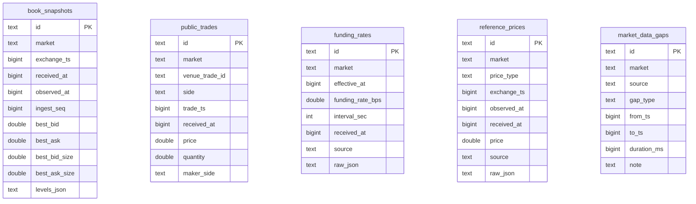
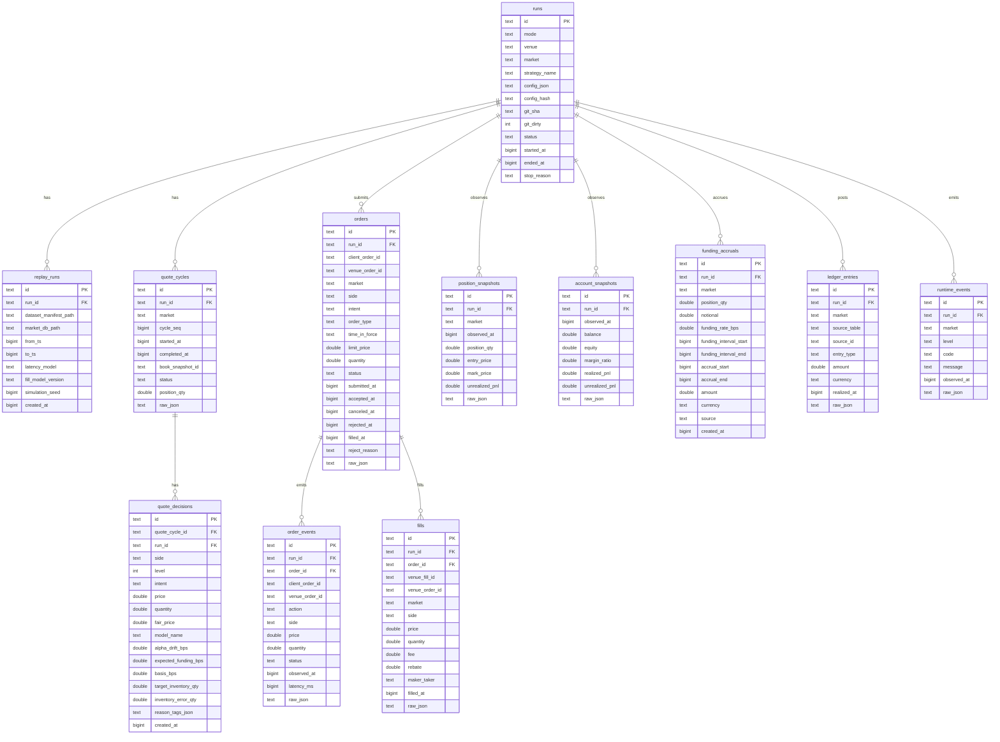

# Database

## Database 一覧

| DB                | Path                                   | Owner                       | 内容                                  |
| ----------------- | -------------------------------------- | --------------------------- | ------------------------------------- |
| Market DB         | `data/market/<venue>/<yyyy-mm>.sqlite` | `market-data-collector`     | public market facts                   |
| Run DB            | `data/runs/<venue>.sqlite`             | bot runtime / replay runner | private run facts and accounting      |
| Legacy metrics DB | `data/mm.db`                           | current runtime             | 現行 metrics schema。移行完了まで維持 |

## Folder Structure

```text
data/
  market/
    <venue>/
      <yyyy-mm>.sqlite
      <yyyy-mm>.manifest.json
  runs/
    <venue>.sqlite
  strategy-runs/
    <timestamp>-<label>/
      manifest.json
      evaluation.json
      report.md
  metrics/
    <run_id>/
```

## Market DB Table Roles

Market DB は venue 別 file。DB には replay に必要な fact と、replay してはいけない時間帯だけを保存する。
collector の起動情報は DB table にせず、同じ月の `<yyyy-mm>.manifest.json` に保存する。

| Table              | 必要度 | 何を保存するか                               |
| ------------------ | ------ | -------------------------------------------- |
| `book_snapshots`   | 必須   | replay input。L2 top-N book                  |
| `public_trades`    | 必須   | replay / fill model input。public trade tape |
| `funding_rates`    | 必須   | funding-aware signal / funding PnL input     |
| `reference_prices` | 必須   | mark/index/oracle。basis と valuation input  |
| `market_data_gaps` | 必須   | 欠損区間。replay で除外/警告するための記録   |

## Market DB ER 図



## Run DB ER 図



## Market DB Tables

Key: 🔑 PK / 🔗 FK / ⭐ Unique key / 📌 Indexed。複合 key は対象列すべてに付ける。

### `book_snapshots`

L2 book の snapshot。top-N levels は JSON で保存する。

| Column          | Type     | Key | Required | Note                 |
| --------------- | -------- | --- | -------- | -------------------- |
| `id`            | `text`   | 🔑  | yes      | snapshot id          |
| `market`        | `text`   | 📌  | yes      | venue market symbol  |
| `exchange_ts`   | `bigint` |     | no       | venue timestamp      |
| `received_at`   | `bigint` |     | yes      | local receive time   |
| `observed_at`   | `bigint` | 📌  | yes      | normalized time      |
| `ingest_seq`    | `bigint` | 📌  | yes      | collector sequence   |
| `best_bid`      | `double` |     | yes      | top bid price        |
| `best_ask`      | `double` |     | yes      | top ask price        |
| `best_bid_size` | `double` |     | yes      | top bid quantity     |
| `best_ask_size` | `double` |     | yes      | top ask quantity     |
| `levels_json`   | `text`   |     | yes      | top-N bid/ask levels |

Indexes:

- `idx_book_snapshots_market_time` (`market`, `observed_at`)
- `idx_book_snapshots_market_seq` (`market`, `ingest_seq`)

### `public_trades`

public trade tape。

| Column           | Type     | Key  | Required | Note                   |
| ---------------- | -------- | ---- | -------- | ---------------------- |
| `id`             | `text`   | 🔑   | yes      | trade row id           |
| `market`         | `text`   | 📌⭐ | yes      | venue market symbol    |
| `venue_trade_id` | `text`   | ⭐   | no       | venue trade id         |
| `side`           | `text`   |      | no       | aggressor side         |
| `price`          | `double` |      | yes      | trade price            |
| `quantity`       | `double` |      | yes      | trade quantity         |
| `trade_ts`       | `bigint` | 📌   | yes      | venue trade time       |
| `received_at`    | `bigint` |      | yes      | local receive time     |
| `maker_side`     | `text`   |      | no       | maker side if known    |
| `raw_json`       | `text`   |      | no       | source payload summary |

Indexes:

- `idx_public_trades_market_time` (`market`, `trade_ts`)
- `idx_public_trades_venue_id` (`market`, `venue_trade_id`) ⭐

### `funding_rates`

market-level funding rate。

| Column             | Type      | Key | Required | Note                   |
| ------------------ | --------- | --- | -------- | ---------------------- |
| `id`               | `text`    | 🔑  | yes      | funding row id         |
| `market`           | `text`    | ⭐  | yes      | venue market symbol    |
| `funding_rate_bps` | `double`  |     | yes      | funding rate in bps    |
| `interval_sec`     | `integer` |     | yes      | funding interval       |
| `effective_at`     | `bigint`  | ⭐  | yes      | funding effective time |
| `received_at`      | `bigint`  |     | yes      | local receive time     |
| `source`           | `text`    |     | yes      | venue/source name      |
| `raw_json`         | `text`    |     | no       | source payload summary |

Indexes:

- `idx_funding_rates_market_effective` (`market`, `effective_at`) ⭐

### `reference_prices`

mark/index/oracle price。

| Column        | Type     | Key | Required | Note                  |
| ------------- | -------- | --- | -------- | --------------------- |
| `id`          | `text`   | 🔑  | yes      | price row id          |
| `market`      | `text`   | 📌  | yes      | venue market symbol   |
| `price_type`  | `text`   | 📌  | yes      | mark / index / oracle |
| `price`       | `double` |     | yes      | observed price        |
| `exchange_ts` | `bigint` |     | no       | source timestamp      |
| `observed_at` | `bigint` | 📌  | yes      | normalized time       |
| `received_at` | `bigint` |     | yes      | local receive time    |
| `source`      | `text`   |     | yes      | venue/source name     |
| `raw_json`    | `text`   |     | no       | source summary        |

Indexes:

- `idx_reference_prices_market_type_time` (`market`, `price_type`, `observed_at`)

### `market_data_gaps`

market data collection gap。backtest input ではなく、欠損区間を避ける/評価から除外するための ops/audit table。

| Column        | Type     | Key | Required | Note                    |
| ------------- | -------- | --- | -------- | ----------------------- |
| `id`          | `text`   | 🔑  | yes      | gap row id              |
| `market`      | `text`   | 📌  | no       | nullable venue-wide gap |
| `source`      | `text`   |     | yes      | stream/source name      |
| `gap_type`    | `text`   |     | yes      | reconnect/stale/seq gap |
| `from_ts`     | `bigint` | 📌  | yes      | gap start               |
| `to_ts`       | `bigint` | 📌  | yes      | gap end                 |
| `duration_ms` | `bigint` |     | yes      | gap length              |
| `note`        | `text`   |     | no       | nullable                |

Indexes:

- `idx_market_data_gaps_market_time` (`market`, `from_ts`, `to_ts`)

## Run DB Tables

Key: 🔑 PK / 🔗 FK / ⭐ Unique key / 📌 Indexed。複合 key は対象列すべてに付ける。

### `runs`

bot / replay の実行単位。

| Column          | Type      | Key | Required | Note                  |
| --------------- | --------- | --- | -------- | --------------------- |
| `id`            | `text`    | 🔑  | yes      | run id                |
| `mode`          | `text`    | 📌  | yes      | live/paper/backtest   |
| `venue`         | `text`    |     | yes      | e.g. `bulk`           |
| `market`        | `text`    | 📌  | yes      | venue market symbol   |
| `strategy_name` | `text`    |     | yes      | strategy id           |
| `config_json`   | `text`    |     | yes      | sanitized config      |
| `config_hash`   | `text`    |     | yes      | stable config hash    |
| `git_sha`       | `text`    |     | no       | nullable              |
| `git_dirty`     | `integer` |     | yes      | 0 / 1                 |
| `started_at`    | `bigint`  | 📌  | yes      | epoch ms              |
| `ended_at`      | `bigint`  |     | no       | epoch ms              |
| `status`        | `text`    |     | yes      | running/completed/... |
| `stop_reason`   | `text`    |     | no       | nullable              |

Indexes:

- `idx_runs_started` (`started_at`)
- `idx_runs_mode_market_started` (`mode`, `market`, `started_at`)

### `replay_runs`

backtest/replay の再現情報。

| Column                  | Type     | Key  | Required | Note                   |
| ----------------------- | -------- | ---- | -------- | ---------------------- |
| `id`                    | `text`   | 🔑   | yes      | replay row id          |
| `run_id`                | `text`   | 🔗⭐ | yes      | `runs.id`              |
| `dataset_manifest_path` | `text`   |      | yes      | manifest path          |
| `market_db_path`        | `text`   |      | yes      | replay source DB       |
| `from_ts`               | `bigint` |      | yes      | replay start           |
| `to_ts`                 | `bigint` |      | yes      | replay end             |
| `latency_model`         | `text`   |      | yes      | latency model id       |
| `fill_model_version`    | `text`   |      | yes      | fill simulator version |
| `simulation_seed`       | `bigint` |      | yes      | deterministic seed     |
| `created_at`            | `bigint` |      | yes      | epoch ms               |

Indexes:

- `idx_replay_runs_run` (`run_id`) ⭐

### `quote_cycles`

quote decision cycle。

| Column             | Type     | Key  | Required | Note                      |
| ------------------ | -------- | ---- | -------- | ------------------------- |
| `id`               | `text`   | 🔑   | yes      | cycle id                  |
| `run_id`           | `text`   | 🔗⭐ | yes      | `runs.id`                 |
| `market`           | `text`   |      | yes      | venue market symbol       |
| `cycle_seq`        | `bigint` | ⭐   | yes      | run-local sequence        |
| `started_at`       | `bigint` | 📌   | yes      | epoch ms                  |
| `completed_at`     | `bigint` |      | no       | epoch ms                  |
| `status`           | `text`   |      | yes      | quoted/skipped/failed     |
| `book_snapshot_id` | `text`   |      | no       | logical Market DB ref     |
| `position_qty`     | `double` |      | no       | position at decision time |
| `raw_json`         | `text`   |      | no       | compact context           |

Indexes:

- `idx_quote_cycles_run_seq` (`run_id`, `cycle_seq`) ⭐
- `idx_quote_cycles_run_time` (`run_id`, `started_at`)

### `quote_decisions`

bot が出した quote intent。

| Column                 | Type      | Key  | Required | Note                     |
| ---------------------- | --------- | ---- | -------- | ------------------------ |
| `id`                   | `text`    | 🔑   | yes      | decision id              |
| `run_id`               | `text`    | 🔗📌 | yes      | `runs.id`                |
| `quote_cycle_id`       | `text`    | 🔗⭐ | yes      | `quote_cycles.id`        |
| `side`                 | `text`    | ⭐   | yes      | buy/sell                 |
| `level`                | `integer` | ⭐   | yes      | ladder level             |
| `intent`               | `text`    |      | yes      | quote/reduce/disabled    |
| `price`                | `double`  |      | yes      | planned price            |
| `quantity`             | `double`  |      | yes      | planned quantity         |
| `fair_price`           | `double`  |      | yes      | model fair price         |
| `model_name`           | `text`    |      | yes      | quote model id           |
| `alpha_drift_bps`      | `double`  |      | no       | funding-aware diagnostic |
| `expected_funding_bps` | `double`  |      | no       | funding-aware diagnostic |
| `basis_bps`            | `double`  |      | no       | funding-aware diagnostic |
| `target_inventory_qty` | `double`  |      | no       | funding-aware diagnostic |
| `inventory_error_qty`  | `double`  |      | no       | funding-aware diagnostic |
| `reason_tags_json`     | `text`    |      | no       | gate/control reasons     |
| `created_at`           | `bigint`  | 📌   | yes      | epoch ms                 |

Indexes:

- `idx_quote_decisions_cycle_side_level` (`quote_cycle_id`, `side`, `level`) ⭐
- `idx_quote_decisions_run_created` (`run_id`, `created_at`)

### `orders`

order state projection。

| Column            | Type     | Key  | Required | Note                |
| ----------------- | -------- | ---- | -------- | ------------------- |
| `id`              | `text`   | 🔑   | yes      | order id            |
| `run_id`          | `text`   | 🔗⭐ | yes      | `runs.id`           |
| `client_order_id` | `text`   | ⭐   | yes      | bot-generated id    |
| `venue_order_id`  | `text`   | 📌   | no       | venue ack id        |
| `market`          | `text`   |      | yes      | venue market symbol |
| `side`            | `text`   |      | yes      | buy/sell            |
| `intent`          | `text`   |      | yes      | quote/reduce/close  |
| `order_type`      | `text`   |      | yes      | limit/market        |
| `time_in_force`   | `text`   |      | yes      | e.g. GTC            |
| `limit_price`     | `double` |      | no       | nullable            |
| `quantity`        | `double` |      | yes      | order quantity      |
| `status`          | `text`   | 📌   | yes      | normalized state    |
| `submitted_at`    | `bigint` |      | yes      | epoch ms            |
| `accepted_at`     | `bigint` |      | no       | epoch ms            |
| `canceled_at`     | `bigint` |      | no       | epoch ms            |
| `rejected_at`     | `bigint` |      | no       | epoch ms            |
| `filled_at`       | `bigint` |      | no       | epoch ms            |
| `reject_reason`   | `text`   |      | no       | nullable            |
| `raw_json`        | `text`   |      | no       | venue response      |

Indexes:

- `idx_orders_run_client` (`run_id`, `client_order_id`) ⭐
- `idx_orders_run_venue_order` (`run_id`, `venue_order_id`)
- `idx_orders_run_status` (`run_id`, `status`)

### `order_events`

order lifecycle event stream。

| Column            | Type     | Key  | Required | Note                     |
| ----------------- | -------- | ---- | -------- | ------------------------ |
| `id`              | `text`   | 🔑   | yes      | event id                 |
| `run_id`          | `text`   | 🔗📌 | yes      | `runs.id`                |
| `order_id`        | `text`   | 🔗📌 | no       | `orders.id` when known   |
| `client_order_id` | `text`   |      | no       | bot-generated id         |
| `venue_order_id`  | `text`   |      | no       | venue order id           |
| `action`          | `text`   |      | yes      | submit/ack/reject/cancel |
| `side`            | `text`   |      | no       | buy/sell                 |
| `price`           | `double` |      | no       | event price              |
| `quantity`        | `double` |      | no       | event quantity           |
| `status`          | `text`   |      | no       | normalized status        |
| `latency_ms`      | `bigint` |      | no       | observed latency         |
| `observed_at`     | `bigint` | 📌   | yes      | epoch ms                 |
| `raw_json`        | `text`   |      | no       | venue payload            |

Indexes:

- `idx_order_events_run_time` (`run_id`, `observed_at`)
- `idx_order_events_order_time` (`order_id`, `observed_at`)

### `fills`

execution fact。

| Column           | Type     | Key  | Required | Note                |
| ---------------- | -------- | ---- | -------- | ------------------- |
| `id`             | `text`   | 🔑   | yes      | fill row id         |
| `run_id`         | `text`   | 🔗⭐ | yes      | `runs.id`           |
| `order_id`       | `text`   | 🔗📌 | no       | `orders.id`         |
| `venue_fill_id`  | `text`   | ⭐   | yes      | venue/generated id  |
| `venue_order_id` | `text`   |      | no       | venue order id      |
| `market`         | `text`   |      | yes      | venue market symbol |
| `side`           | `text`   |      | yes      | buy/sell            |
| `price`          | `double` |      | yes      | execution price     |
| `quantity`       | `double` |      | yes      | executed quantity   |
| `fee`            | `double` |      | yes      | fee amount          |
| `rebate`         | `double` |      | yes      | rebate amount       |
| `maker_taker`    | `text`   |      | yes      | maker/taker/unknown |
| `filled_at`      | `bigint` | 📌   | yes      | epoch ms            |
| `raw_json`       | `text`   |      | no       | fill summary        |

Indexes:

- `idx_fills_run_time` (`run_id`, `filled_at`)
- `idx_fills_run_venue_fill` (`run_id`, `venue_fill_id`) ⭐
- `idx_fills_order` (`order_id`)

### `position_snapshots`

position timeline。

| Column           | Type     | Key  | Required | Note                 |
| ---------------- | -------- | ---- | -------- | -------------------- |
| `id`             | `text`   | 🔑   | yes      | snapshot id          |
| `run_id`         | `text`   | 🔗⭐ | yes      | `runs.id`            |
| `market`         | `text`   | ⭐   | yes      | venue market symbol  |
| `observed_at`    | `bigint` | ⭐   | yes      | epoch ms             |
| `position_qty`   | `double` |      | yes      | signed base quantity |
| `entry_price`    | `double` |      | no       | nullable             |
| `mark_price`     | `double` |      | no       | valuation price      |
| `unrealized_pnl` | `double` |      | no       | venue/account value  |
| `raw_json`       | `text`   |      | no       | source summary       |

Indexes:

- `idx_position_snapshots_run_market_time` (`run_id`, `market`, `observed_at`) ⭐

### `account_snapshots`

account equity/risk timeline。

| Column           | Type     | Key  | Required | Note                |
| ---------------- | -------- | ---- | -------- | ------------------- |
| `id`             | `text`   | 🔑   | yes      | snapshot id         |
| `run_id`         | `text`   | 🔗⭐ | yes      | `runs.id`           |
| `observed_at`    | `bigint` | ⭐   | yes      | epoch ms            |
| `balance`        | `double` |      | no       | account balance     |
| `equity`         | `double` |      | no       | account equity      |
| `margin_ratio`   | `double` |      | no       | venue risk metric   |
| `realized_pnl`   | `double` |      | no       | venue/account value |
| `unrealized_pnl` | `double` |      | no       | venue/account value |
| `raw_json`       | `text`   |      | no       | source summary      |

Indexes:

- `idx_account_snapshots_run_time` (`run_id`, `observed_at`) ⭐

### `funding_accruals`

funding cashflow fact。

| Column                   | Type     | Key  | Required | Note                  |
| ------------------------ | -------- | ---- | -------- | --------------------- |
| `id`                     | `text`   | 🔑   | yes      | accrual id            |
| `run_id`                 | `text`   | 🔗📌 | yes      | `runs.id`             |
| `market`                 | `text`   | 📌   | yes      | venue market symbol   |
| `position_qty`           | `double` |      | yes      | signed position       |
| `notional`               | `double` |      | yes      | position notional     |
| `funding_rate_bps`       | `double` |      | yes      | applied funding rate  |
| `funding_interval_start` | `bigint` |      | yes      | source interval start |
| `funding_interval_end`   | `bigint` |      | yes      | source interval end   |
| `accrual_start`          | `bigint` |      | yes      | held interval start   |
| `accrual_end`            | `bigint` | 📌   | yes      | held interval end     |
| `amount`                 | `double` |      | yes      | signed cashflow       |
| `currency`               | `text`   |      | yes      | quote currency        |
| `source`                 | `text`   |      | yes      | venue/replay          |
| `created_at`             | `bigint` |      | yes      | epoch ms              |

Indexes:

- `idx_funding_accruals_run_market_end` (`run_id`, `market`, `accrual_end`)

### `ledger_entries`

accounting source of truth。

| Column         | Type     | Key  | Required | Note                        |
| -------------- | -------- | ---- | -------- | --------------------------- |
| `id`           | `text`   | 🔑   | yes      | ledger entry id             |
| `run_id`       | `text`   | 🔗📌 | yes      | `runs.id`                   |
| `market`       | `text`   |      | no       | nullable account-wide entry |
| `source_table` | `text`   | ⭐   | no       | fills/funding_accruals/etc  |
| `source_id`    | `text`   | ⭐   | no       | source row id               |
| `entry_type`   | `text`   | ⭐📌 | yes      | trade/funding/fee/etc       |
| `amount`       | `double` |      | yes      | signed amount               |
| `currency`     | `text`   |      | yes      | accounting currency         |
| `realized_at`  | `bigint` | 📌   | yes      | epoch ms                    |
| `raw_json`     | `text`   |      | no       | source summary              |

Indexes:

- `idx_ledger_entries_run_time` (`run_id`, `realized_at`)
- `idx_ledger_entries_source` (`source_table`, `source_id`, `entry_type`) ⭐
- `idx_ledger_entries_run_type` (`run_id`, `entry_type`)

### `runtime_events`

runtime health / incident fact。

| Column        | Type     | Key  | Required | Note                         |
| ------------- | -------- | ---- | -------- | ---------------------------- |
| `id`          | `text`   | 🔑   | yes      | event id                     |
| `run_id`      | `text`   | 🔗📌 | yes      | `runs.id`                    |
| `market`      | `text`   |      | no       | nullable run-wide event      |
| `level`       | `text`   |      | yes      | info/warn/error              |
| `code`        | `text`   | 📌   | yes      | stable machine-readable code |
| `message`     | `text`   |      | yes      | short message                |
| `observed_at` | `bigint` | 📌   | yes      | epoch ms                     |
| `raw_json`    | `text`   |      | no       | context                      |

Indexes:

- `idx_runtime_events_run_time` (`run_id`, `observed_at`)
- `idx_runtime_events_run_code` (`run_id`, `code`)

## Logical Cross-DB References

| From                                | To                                                     | Note                                    |
| ----------------------------------- | ------------------------------------------------------ | --------------------------------------- |
| `quote_cycles.book_snapshot_id`     | Market DB `book_snapshots.id`                          | SQLite file 分割のため physical FK なし |
| `replay_runs.market_db_path`        | `data/market/<venue>/<yyyy-mm>.sqlite`                 | replay source                           |
| `replay_runs.dataset_manifest_path` | `data/strategy-runs/<timestamp>-<label>/manifest.json` | replay dataset definition               |

## PnL Source

| Metric        | Source                                                   |
| ------------- | -------------------------------------------------------- |
| trade PnL     | `ledger_entries.entry_type = 'realized_trade_pnl'`       |
| inventory PnL | `ledger_entries.entry_type = 'unrealized_inventory_pnl'` |
| fee           | `ledger_entries.entry_type = 'fee'`                      |
| rebate        | `ledger_entries.entry_type = 'rebate'`                   |
| funding PnL   | `ledger_entries.entry_type = 'funding_pnl'`              |
| net PnL       | `SUM(ledger_entries.amount)`                             |
