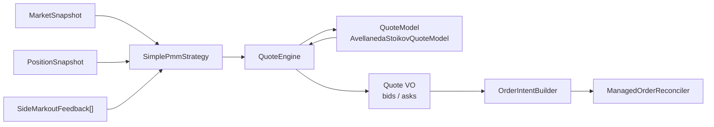

# Strategy

この文書は現在の quote generation と order refresh の実装仕様をまとめる。古い typo 付き strategy docs は削除し、ここを strategy flow の参照先にする。

## 全体像



`strategies/` には `Strategy` contract、返り値 ADT の `StrategyDecision`、input signal の `SideMarkoutFeedback`、具象 strategy 実装を置く。`StrategyDecision` は value object ではなく strategy contract の一部として扱う。

## Tick 内の quoting cycle

`Bot` の tick 順序は risk guard、event drain、position sync、inventory reduction、quoting cycle の順を維持する。quoting cycle は `QuotingCycleService` が orchestration し、旧 use case の責務は次に分解済み。

1. `QuotingCycleService` が market snapshot、position、markout feedback を読む
2. `SimplePmmStrategy.decide(...)` が markout feedback から side spec を作る
3. `QuoteEngine.compute(...)` が fair price、volatility、QuoteModel 出力、ladder、inventory cap を合成して `Quote` を返す
4. `OrderIntentBuilder.build(...)` が `Quote` を venue-neutral な `OrderIntent[]` に変換する
5. `ManagedOrderReconciler.reconcile(...)` が active orders と target intents を収束させる

## QuoteModel と Strategy

`AvellanedaStoikovQuoteModel` は pricing model。reservation price、spread、top-level bid/ask の raw model output を作る。

`SimplePmmStrategy` は bot behavior。markout feedback を見て bid/ask の有効化、distance multiplier、size multiplier、reason tags を決め、`QuoteEngine` に計算を委譲する。

この分離により、A-S 以外の pricing model は `domain/quote-models/` に追加し、regime-aware PMM のような bot behavior は `domain/strategies/` に追加する。

## VolatilityEstimator

`VolatilityEstimator` は `domain/services/VolatilityEstimator.ts` に置く。価格列から sigma を更新する pure な domain service であり、VO でも application service でもない。

現時点では interface 化しない。複数 estimator を runtime で差し替える必要が出た段階で `VolatilityModel` contract を追加する。

## Order Lifecycle

`OrderManager` class と別立ての `OrderReconciler` interface/file は廃止する。現状は実装が1つだけなので、reconcile の result/error contract は `ManagedOrderReconciler.ts` に colocate する。

```text
Quote
  -> OrderIntent[]
  -> ManagedOrderReconciler
  -> OrderGateway place/cancel
  -> VenueOrder
```

`OrderIntent` は venue に送る前の注文意図で、`clientOrderId`、`timeInForce`、`postOnly`、`reduceOnly` を持つ。`venueOrderId` や filled status は venue order 側の責務。

## ExposureIntent

新しい intent 名は exposure を基準にする。

```text
increase_exposure
reduce_exposure
```

旧 `open_quote` / `reduce_inventory` は使わない。DB や metrics の stored intent は互換性のため `"quote"` / `"reduce"` のまま維持する。
