# Bot Performance Report

- Generated: `2026-05-07T13:15:38.799Z`
- Mode: `live`
- Venue: `bulk`

## KPI Summary

| Metric            | 24h      | 7d       |
| ----------------- | -------- | -------- |
| Net PnL           | -14.8481 | -14.8481 |
| Trade PnL         | -14.8481 | -14.8481 |
| Markout 5s (sum)  | -23.3279 | -23.3279 |
| Markout 30s (sum) | -2.9932  | -2.9932  |
| Max Drawdown      | 26.4094  | 26.4094  |
| Sharpe            | -0.718   | -0.718   |
| Fill Rate         | 100.00%  | 100.00%  |
| Fill Count        | 200      | 200      |
| Adverse Selection | 50.00%   | 50.00%   |

## Tier 1 — Core (24h)

### Equity Curve (24h)

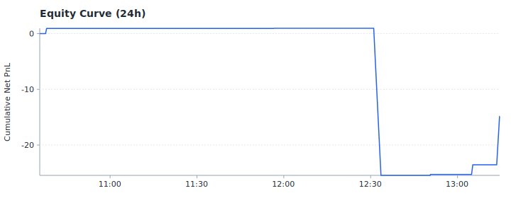

### Drawdown (24h)

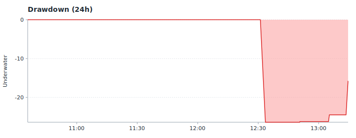

### Markout 5s Distribution (24h)

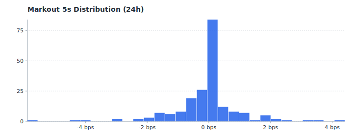

### Markout 30s Distribution (24h)

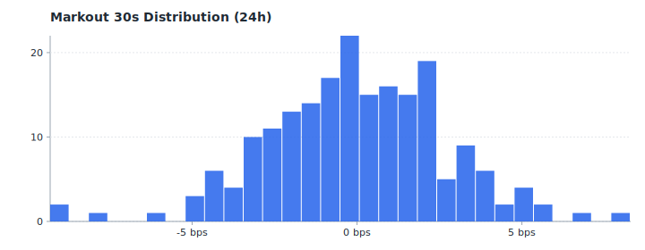

### Hourly Markout (5s, bps) (24h)

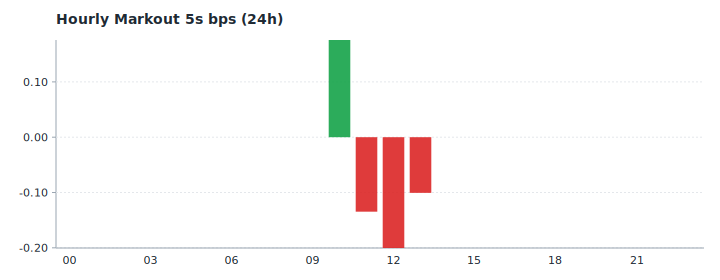

## Tier 2 — Execution (24h)

### Trade PnL Distribution (24h)

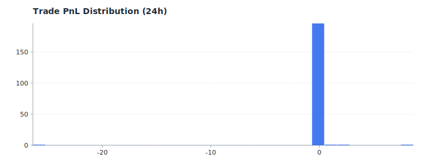

### Adverse Selection Rate (24h)

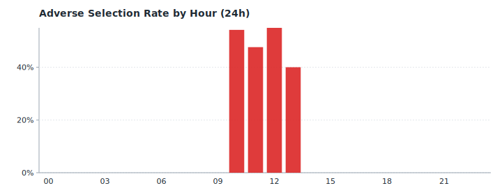

### Fill Count (Buy/Sell) (24h)

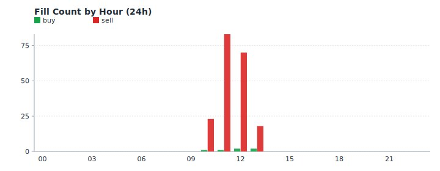

### Fee vs Trade PnL (24h)

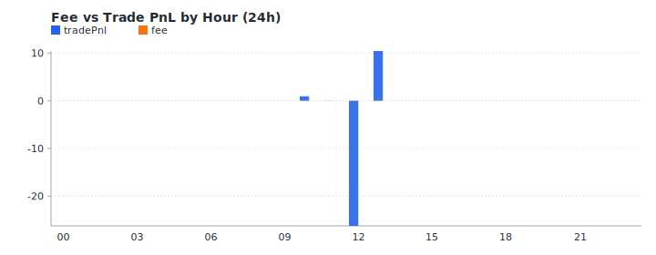

## Tier 3 — Supplementary (24h)

### Market Volume (24h)

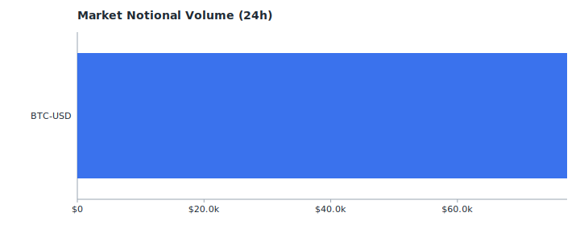

### Fill Price vs Mid (24h)

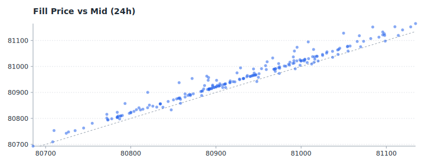

## Tier 1 — Core (7d)

### Equity Curve (7d)

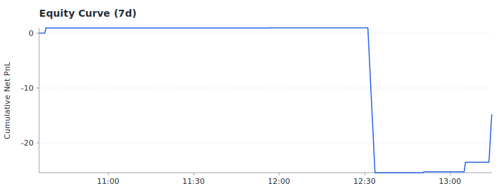

### Drawdown (7d)

### Markout 5s Distribution (7d)

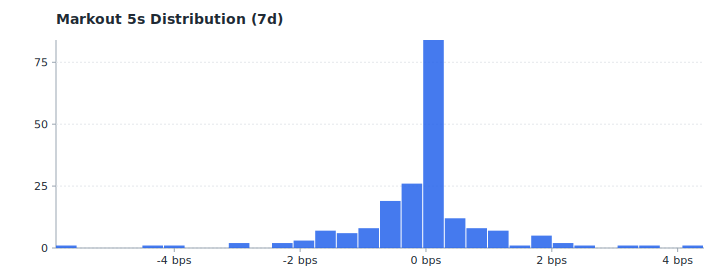

### Markout 30s Distribution (7d)

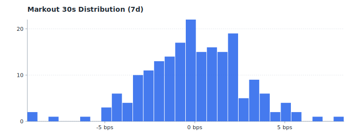

### Hourly Markout (5s, bps) (7d)

## Tier 2 — Execution (7d)

### Trade PnL Distribution (7d)

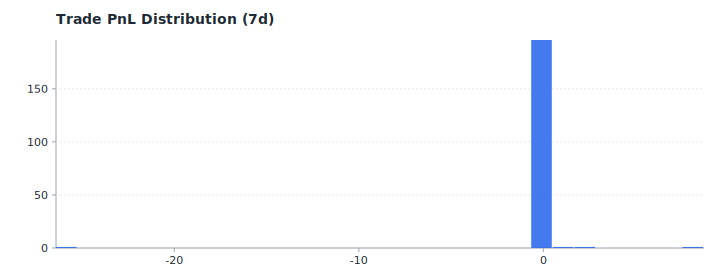

### Adverse Selection Rate (7d)

### Fill Count (Buy/Sell) (7d)

### Fee vs Trade PnL (7d)

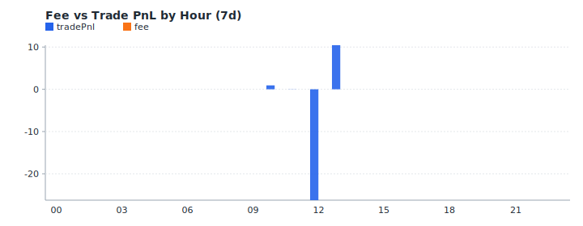

## Tier 3 — Supplementary (7d)

### Rolling Sharpe (7d)

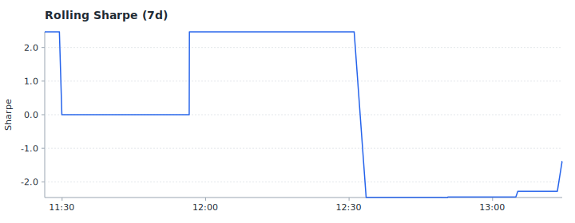

### Market Volume (7d)

