# Bot Performance Report

- Generated: `2026-05-06T13:40:00.000Z`
- Mode: `live`
- Venue: `all`

## KPI Summary

| Metric            | 24h     | 7d      |
| ----------------- | ------- | ------- |
| Net PnL           | -2.1000 | -2.1000 |
| Trade PnL         | 0.0000  | 0.0000  |
| Markout 5s (sum)  | 0.2096  | 0.2096  |
| Markout 30s (sum) | 0.3144  | 0.3144  |
| Max Drawdown      | 2.1000  | 2.1000  |
| Sharpe            | -1.548  | -1.548  |
| Fill Rate         | 100.00% | 100.00% |
| Fill Count        | 1005    | 1005    |
| Adverse Selection | 0.00%   | 0.00%   |

## Tier 1 — Core (24h)

### Equity Curve (24h)

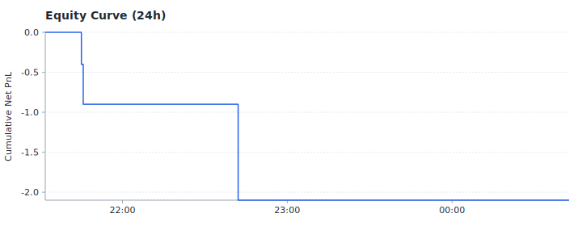

### Drawdown (24h)

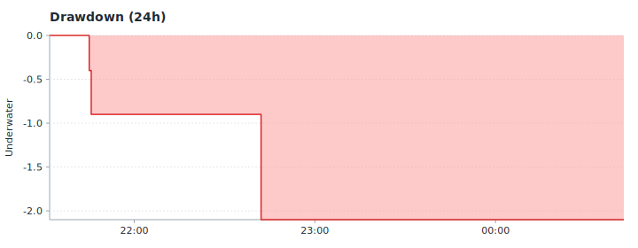

### Markout 5s Distribution (24h)

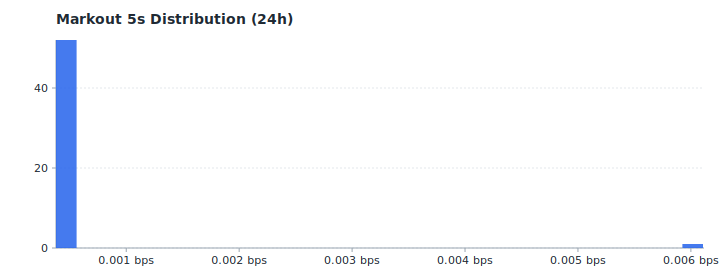

### Markout 30s Distribution (24h)

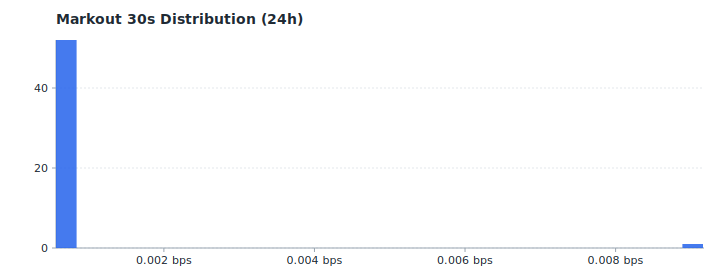

### Hourly Markout (5s, bps) (24h)

## Tier 2 — Execution (24h)

### Trade PnL Distribution (24h)

### Adverse Selection Rate (24h)

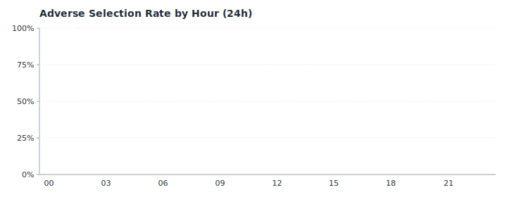

### Fill Count (Buy/Sell) (24h)

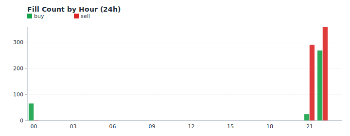

### Fee vs Trade PnL (24h)

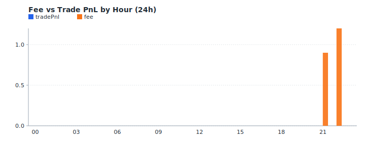

## Tier 3 — Supplementary (24h)

### Market Volume (24h)

### Fill Price vs Mid (24h)

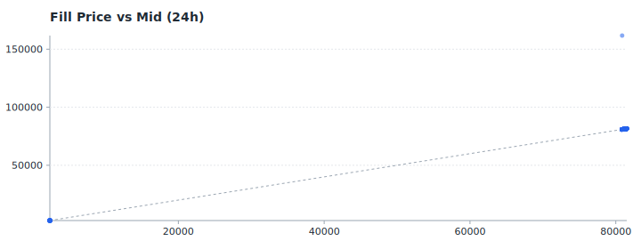

## Tier 1 — Core (7d)

### Equity Curve (7d)

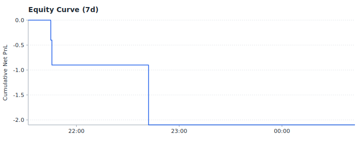

### Drawdown (7d)

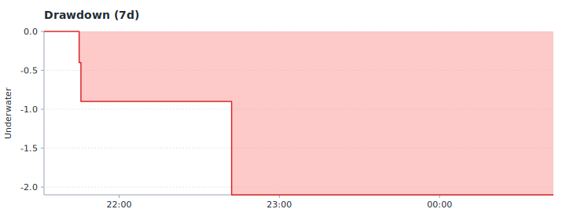

### Markout 5s Distribution (7d)

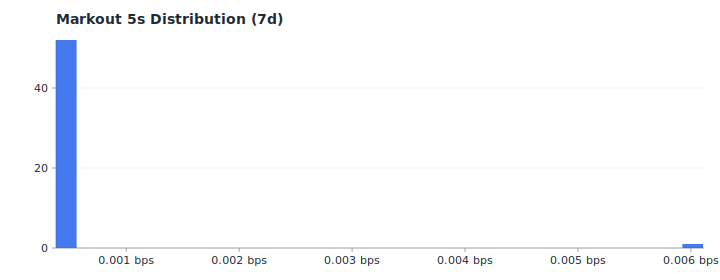

### Markout 30s Distribution (7d)

### Hourly Markout (5s, bps) (7d)

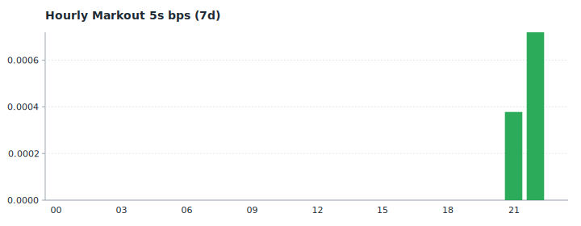

## Tier 2 — Execution (7d)

### Trade PnL Distribution (7d)

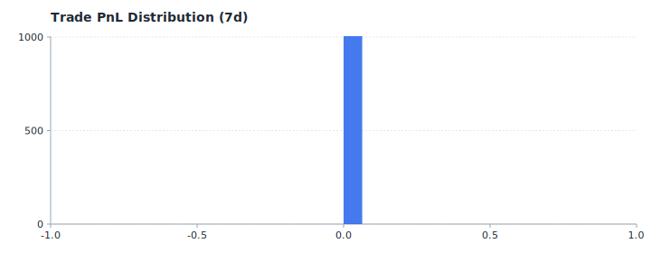

### Adverse Selection Rate (7d)

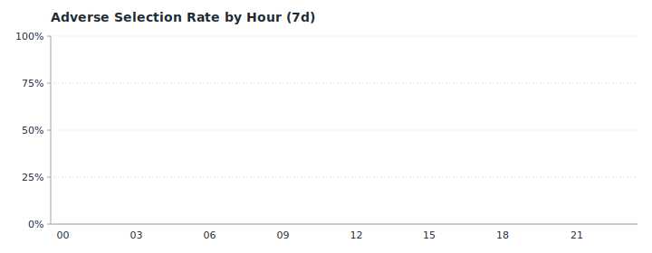

### Fill Count (Buy/Sell) (7d)

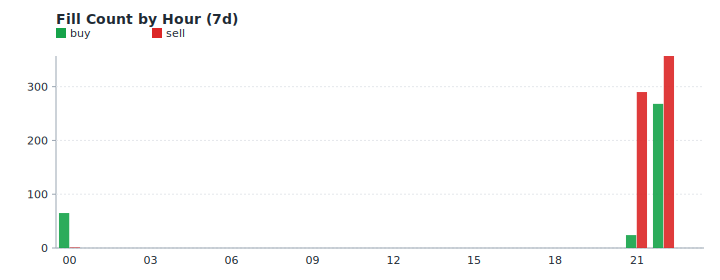

### Fee vs Trade PnL (7d)

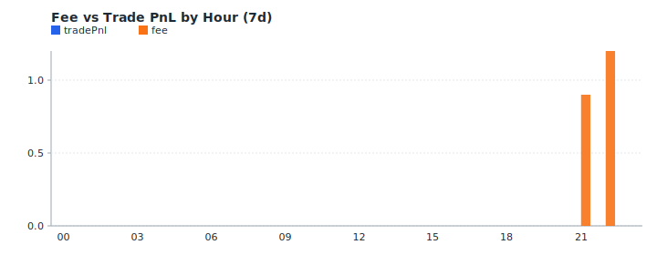

## Tier 3 — Supplementary (7d)

### Rolling Sharpe (7d)

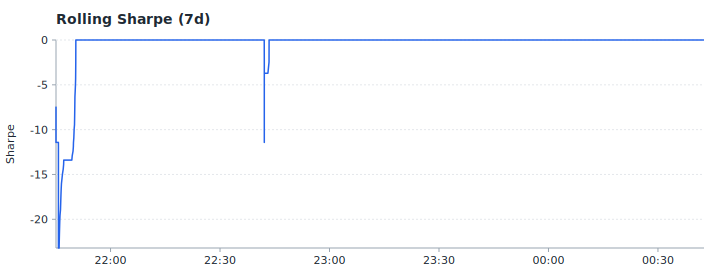

### Market Volume (7d)

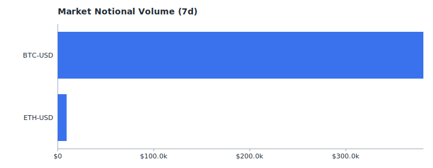
