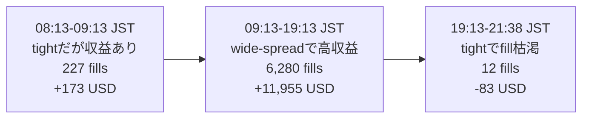

# 2026-05-12 Bulk BTC-USD Regime Shift

## 概要

run `dce95392-ff9b-42ad-b23a-ffe8758cbb4c` は、日中はかなり良く fill して PnL も伸びていたが、`2026-05-12 19:13 JST` 以降に fill がほぼ止まった。

結論として、これは order reject や DB 詰まりではなく、**市場が tight-spread regime に変わったことで、bot の ALO quote が best から遠くなりすぎて約定対象から外れた**現象だった。



## Data Coverage

| 項目           | 値                                     |
| -------------- | -------------------------------------- |
| DB             | `data/mm.db`                           |
| Run ID         | `dce95392-ff9b-42ad-b23a-ffe8758cbb4c` |
| mode           | `live`                                 |
| venue / market | `bulk` / `BTC-USD`                     |
| strategy       | `avellaneda-stoikov`                   |
| capital mode   | `beta_mock`                            |
| run window     | `2026-05-12 08:13:40-21:38:01 JST`     |

利用した table / view:

- `trading_runs`: run metadata
- `orderbook_snapshots`: best bid/ask、spread、`raw_json` 内の top depth
- `submitted_orders`: submitted / filled / rejected / cancelled の order lifecycle
- `trade_fills`: notional、realized PnL、fill timing
- `v_quote_competitiveness`: quote の best / mid からの距離
- `v_fill_markouts`: fill 後 5s / 30s / 300s markout

この DB からは分からないもの:

- book level の counterparty / owner ID
- 誰が best bid/ask を詰めたかという具体的な actor
- venue 全体の aggressor identity や外部市場 lead/lag

そのため「誰によって市場が変わったか」は個別 participant までは特定できない。DB から言えるのは、外部参加者の liquidity によって best bid/ask と top-of-book depth が変わり、bot の quote が relative に遠くなった、というところまで。

## Phase Definition

run を次の3 phase に分けた。

| phase                  | JST window  | 定義                                                    |
| ---------------------- | ----------- | ------------------------------------------------------- |
| `early_tight_positive` | 08:13-09:13 | tight spread だが、まだ収益が出ていた phase             |
| `wide_spread_good`     | 09:13-19:13 | spread が広く、fill / PnL ともに良かった phase          |
| `tight_starved`        | 19:13-21:38 | tight spread になり、fill が枯れて PnL も悪化した phase |

再現性のため、phase cutoff は固定の UTC epoch milliseconds として扱う。

| cutoff           | JST                     | UTC epoch ms    |
| ---------------- | ----------------------- | --------------- |
| `wide_start_ms`  | 2026-05-12 09:13:41 JST | `1778544821000` |
| `tight_start_ms` | 2026-05-12 19:13:41 JST | `1778580821000` |

## Phase Evidence

| phase                  | market spread | bot distance to best | submitted | fills | fill/submit | fill notional |     net PnL | reject rate |
| ---------------------- | ------------: | -------------------: | --------: | ----: | ----------: | ------------: | ----------: | ----------: |
| `early_tight_positive` |    0.0521 bps |          11.2867 bps |     4,166 |   227 |      5.449% |      $488,226 |    +$173.17 |      0.312% |
| `wide_spread_good`     |    3.7002 bps |           6.5461 bps |    30,016 | 6,280 |     20.922% |   $42,104,034 | +$11,954.88 |      3.755% |
| `tight_starved`        |    0.0896 bps |           8.0312 bps |    10,176 |    12 |      0.118% |       $87,937 |     -$83.08 |      0.246% |

解釈:

- 収益の中心は `wide_spread_good` だった。
- `2026-05-12 19:13 JST` 以降、market spread は `~0.09 bps` まで潰れた。
- bot の quote は best から `~8 bps` 離れたままだったため、ALO order が約定対象から外れた。
- reject rate は低いままなので、order submission 失敗ではない。

## Book Shape

| phase                  | top bid size | top ask size | 5-level bid depth | 5-level ask depth | 5-level bid minus ask |
| ---------------------- | -----------: | -----------: | ----------------: | ----------------: | --------------------: |
| `early_tight_positive` |  25.5841 BTC |  24.1831 BTC |       32.2602 BTC |       34.2582 BTC |           -1.9980 BTC |
| `wide_spread_good`     |  15.4708 BTC | 147.2556 BTC |       44.3834 BTC |      340.7516 BTC |         -296.3682 BTC |
| `tight_starved`        |  26.7995 BTC |  23.2750 BTC |       37.3373 BTC |       34.0442 BTC |           +3.2931 BTC |

解釈:

- `wide_spread_good` では ask 側 depth がかなり厚く、spread も広かった。この phase では bot の `sell:quote` が収益の大部分を作った。
- `tight_starved` では best bid/ask が非常に近くなり、depth も左右で均衡した。bot の far-from-touch quote は意味のある約定対象から外れた。

## Side / Intent Evidence

| phase                  | side / intent | fills |    notional |     net PnL | net PnL bps | avg 5s markout | avg 30s markout | avg 300s markout |
| ---------------------- | ------------- | ----: | ----------: | ----------: | ----------: | -------------: | --------------: | ---------------: |
| `early_tight_positive` | `buy:quote`   |     7 |    $138,019 |     +$57.27 |      4.1493 |        -1.0990 |         -3.5194 |           1.6721 |
| `early_tight_positive` | `buy:reduce`  |     7 |    $107,664 |     +$57.65 |      5.3546 |        -0.8590 |         -2.1294 |          -7.3421 |
| `early_tight_positive` | `sell:quote`  |   213 |    $242,543 |     +$58.25 |      2.4017 |         8.6681 |          8.7629 |           9.5224 |
| `wide_spread_good`     | `buy:quote`   | 2,150 | $18,580,592 |      +$8.35 |      0.0045 |         2.3369 |          2.3836 |           1.9498 |
| `wide_spread_good`     | `buy:reduce`  |   359 |  $2,582,137 |      +$6.60 |      0.0256 |         1.1843 |          0.8431 |           1.1868 |
| `wide_spread_good`     | `sell:quote`  | 3,602 | $20,005,127 | +$11,496.78 |      5.7469 |         3.8162 |          4.3594 |           5.1078 |
| `wide_spread_good`     | `sell:reduce` |   169 |    $936,178 |    +$443.15 |      4.7336 |         1.3570 |          1.3550 |           0.6522 |
| `tight_starved`        | `buy:quote`   |     4 |     $30,468 |       $0.00 |      0.0000 |        -0.5722 |         -0.5896 |          19.4057 |
| `tight_starved`        | `buy:reduce`  |     1 |     $13,495 |       $0.00 |      0.0000 |        -8.0870 |        -12.1830 |           2.7492 |
| `tight_starved`        | `sell:quote`  |     6 |     $40,384 |     -$72.69 |    -17.9992 |         2.5116 |          8.4823 |          -9.1091 |
| `tight_starved`        | `sell:reduce` |     1 |      $3,589 |     -$10.40 |    -28.9616 |        -1.7322 |         -1.5238 |           9.6706 |

解釈:

- 主な収益 bucket は `wide_spread_good` + `sell:quote`。
- `buy:quote` は wide phase で markout は良かったが、この run では realized PnL はほぼ出ていない。
- `tight_starved` は fill sample が少ないため markout の統計的結論は弱い。ただし fill rate と realized PnL は明確に悪い。

## Root Cause

観測された root cause:

```text
market spread が ~3.7 bps から ~0.09 bps へ圧縮
一方で bot quote の best からの距離は ~8 bps のまま
その結果、ALO quote が non-competitive になり
fill rate が ~20.9% から ~0.1% へ低下
```

これは market-regime mismatch であり、DB stall や Bulk order rejection ではない。

## Constant Revenue への示唆

単一の A-S profile では全 regime をカバーできなかった。

- `wide_spread_good`: 現行の spread-capture profile はよく機能した。
- `tight_starved`: 同じ profile では order は出続けるが、ほぼ fill しない。

regime ごとに profile を切り替えるべき。

| regime                 | signal                                                                 | profile          | 目的                                                            |
| ---------------------- | ---------------------------------------------------------------------- | ---------------- | --------------------------------------------------------------- |
| wide spread profitable | spread `>1 bps`、side markout 正、fill rate 健全                       | `spread_capture` | pure trading EV 最大化                                          |
| tight but neutral      | spread `<0.25 bps`、toxic markout が弱い、incentive-adjusted EV が非負 | `volume_rebate`  | strict loss budget 付きで maker volume / uptime / reward を稼ぐ |
| tight toxic or no edge | spread `<0.25 bps`、low fill かつ realized/tail EV が悪い              | `no_open`        | open quote loss を避ける                                        |
| inventory present      | 非flat position または aging inventory                                 | `defensive_exit` | open quote とは別に inventory を落とす                          |

推奨する次の設計:

```text
RegimeClassifier
  -> StrategyProfile
  -> QuoteControls + execution controls
  -> QuoteEngine / OrderManager
```

Hot path rule:

- quote generation 内で DB view を scan しない。
- regime / profile は cold path で計算し、in-memory の `currentProfile` として公開する。
- `RefreshQuotesUseCase` は profile を同期 read して、analysis query を待たずに quote を作る。

## Reproduction

repository root から実行する。

```bash
sqlite3 -header -column data/mm.db <<'SQL'
WITH params AS (
  SELECT 'dce95392-ff9b-42ad-b23a-ffe8758cbb4c' AS run_id,
         1778544821000 AS wide_start,
         1778580821000 AS tight_start
),
phase_orders AS (
  SELECT CASE
           WHEN submitted_at < (SELECT wide_start FROM params) THEN 'early_tight_positive'
           WHEN submitted_at < (SELECT tight_start FROM params) THEN 'wide_spread_good'
           ELSE 'tight_starved'
         END AS phase,
         COUNT(*) AS submitted,
         SUM(CASE WHEN final_status='rejected' THEN 1 ELSE 0 END) AS rejected
  FROM submitted_orders
  WHERE run_id=(SELECT run_id FROM params)
  GROUP BY 1
),
phase_fills AS (
  SELECT CASE
           WHEN filled_at < (SELECT wide_start FROM params) THEN 'early_tight_positive'
           WHEN filled_at < (SELECT tight_start FROM params) THEN 'wide_spread_good'
           ELSE 'tight_starved'
         END AS phase,
         COUNT(*) AS fills,
         SUM(ABS(price*quantity)) AS notional,
         SUM(trade_pnl-fee) AS net_pnl
  FROM trade_fills
  WHERE run_id=(SELECT run_id FROM params)
  GROUP BY 1
),
phase_books AS (
  SELECT CASE
           WHEN observed_at < (SELECT wide_start FROM params) THEN 'early_tight_positive'
           WHEN observed_at < (SELECT tight_start FROM params) THEN 'wide_spread_good'
           ELSE 'tight_starved'
         END AS phase,
         AVG(spread_bps) AS avg_spread_bps,
         AVG(staleness_ms) AS avg_stale_ms
  FROM orderbook_snapshots
  WHERE run_id=(SELECT run_id FROM params)
  GROUP BY 1
),
phase_qc AS (
  SELECT CASE
           WHEN submitted_at < (SELECT wide_start FROM params) THEN 'early_tight_positive'
           WHEN submitted_at < (SELECT tight_start FROM params) THEN 'wide_spread_good'
           ELSE 'tight_starved'
         END AS phase,
         AVG(distance_to_best_bps) AS avg_dist_best_bps
  FROM v_quote_competitiveness
  WHERE run_id=(SELECT run_id FROM params)
  GROUP BY 1
)
SELECT b.phase,
       ROUND(b.avg_spread_bps,4) AS avg_spread_bps,
       ROUND(q.avg_dist_best_bps,4) AS avg_dist_best_bps,
       o.submitted,
       COALESCE(f.fills,0) AS fills,
       ROUND(100.0*COALESCE(f.fills,0)/o.submitted,3) AS fill_per_submit_pct,
       ROUND(f.notional,0) AS notional,
       ROUND(f.net_pnl,3) AS net_pnl,
       o.rejected,
       ROUND(100.0*o.rejected/o.submitted,3) AS reject_pct,
       ROUND(b.avg_stale_ms,1) AS avg_stale_ms
FROM phase_books b
LEFT JOIN phase_orders o ON o.phase=b.phase
LEFT JOIN phase_fills f ON f.phase=b.phase
LEFT JOIN phase_qc q ON q.phase=b.phase
ORDER BY CASE b.phase
  WHEN 'early_tight_positive' THEN 1
  WHEN 'wide_spread_good' THEN 2
  ELSE 3
END;
SQL
```

Side / intent の再現:

```bash
sqlite3 -header -column data/mm.db <<'SQL'
WITH params AS (
  SELECT 'dce95392-ff9b-42ad-b23a-ffe8758cbb4c' AS run_id,
         1778544821000 AS wide_start,
         1778580821000 AS tight_start
),
enriched AS (
  SELECT CASE
           WHEN f.filled_at < (SELECT wide_start FROM params) THEN 'early_tight_positive'
           WHEN f.filled_at < (SELECT tight_start FROM params) THEN 'wide_spread_good'
           ELSE 'tight_starved'
         END AS phase,
         f.side,
         COALESCE(so.intent, 'unknown') AS intent,
         f.price,
         f.quantity,
         f.trade_pnl,
         f.fee,
         m.markout_5s_bps,
         m.markout_30s_bps,
         m.markout_300s_bps
  FROM trade_fills f
  LEFT JOIN submitted_orders so ON so.id=f.submitted_order_id
  LEFT JOIN v_fill_markouts m ON m.fill_id=f.id
  WHERE f.run_id=(SELECT run_id FROM params)
)
SELECT phase, side, intent,
       COUNT(*) AS fills,
       ROUND(SUM(ABS(price*quantity)),0) AS notional,
       ROUND(SUM(trade_pnl-fee),3) AS net_pnl,
       ROUND(SUM(trade_pnl-fee)*10000/NULLIF(SUM(ABS(price*quantity)),0),4) AS net_pnl_bps,
       ROUND(AVG(markout_5s_bps),4) AS avg_5s,
       ROUND(AVG(markout_30s_bps),4) AS avg_30s,
       ROUND(AVG(markout_300s_bps),4) AS avg_300s
FROM enriched
GROUP BY phase, side, intent
ORDER BY CASE phase
  WHEN 'early_tight_positive' THEN 1
  WHEN 'wide_spread_good' THEN 2
  ELSE 3
END, side, intent;
SQL
```

Book shape の再現:

```bash
sqlite3 -header -column data/mm.db <<'SQL'
WITH params AS (
  SELECT 'dce95392-ff9b-42ad-b23a-ffe8758cbb4c' AS run_id,
         1778544821000 AS wide_start,
         1778580821000 AS tight_start
),
snaps AS (
  SELECT CASE
           WHEN observed_at < (SELECT wide_start FROM params) THEN 'early_tight_positive'
           WHEN observed_at < (SELECT tight_start FROM params) THEN 'wide_spread_good'
           ELSE 'tight_starved'
         END AS phase,
         spread_bps,
         CAST(json_extract(raw_json,'$.orderBookLevels[0].bidSize') AS REAL) AS bid0,
         CAST(json_extract(raw_json,'$.orderBookLevels[0].askSize') AS REAL) AS ask0,
         CAST(json_extract(raw_json,'$.orderBookLevels[1].bidSize') AS REAL) AS bid1,
         CAST(json_extract(raw_json,'$.orderBookLevels[1].askSize') AS REAL) AS ask1,
         CAST(json_extract(raw_json,'$.orderBookLevels[2].bidSize') AS REAL) AS bid2,
         CAST(json_extract(raw_json,'$.orderBookLevels[2].askSize') AS REAL) AS ask2,
         CAST(json_extract(raw_json,'$.orderBookLevels[3].bidSize') AS REAL) AS bid3,
         CAST(json_extract(raw_json,'$.orderBookLevels[3].askSize') AS REAL) AS ask3,
         CAST(json_extract(raw_json,'$.orderBookLevels[4].bidSize') AS REAL) AS bid4,
         CAST(json_extract(raw_json,'$.orderBookLevels[4].askSize') AS REAL) AS ask4
  FROM orderbook_snapshots
  WHERE run_id=(SELECT run_id FROM params)
)
SELECT phase,
       ROUND(AVG(spread_bps),4) AS avg_spread_bps,
       ROUND(AVG(bid0),4) AS avg_top_bid_btc,
       ROUND(AVG(ask0),4) AS avg_top_ask_btc,
       ROUND(AVG(bid0+bid1+bid2+bid3+bid4),4) AS avg_bid_5lvl_btc,
       ROUND(AVG(ask0+ask1+ask2+ask3+ask4),4) AS avg_ask_5lvl_btc,
       ROUND(AVG((bid0+bid1+bid2+bid3+bid4) - (ask0+ask1+ask2+ask3+ask4)),4)
         AS avg_5lvl_bid_minus_ask_btc
FROM snaps
GROUP BY phase
ORDER BY CASE phase
  WHEN 'early_tight_positive' THEN 1
  WHEN 'wide_spread_good' THEN 2
  ELSE 3
END;
SQL
```
