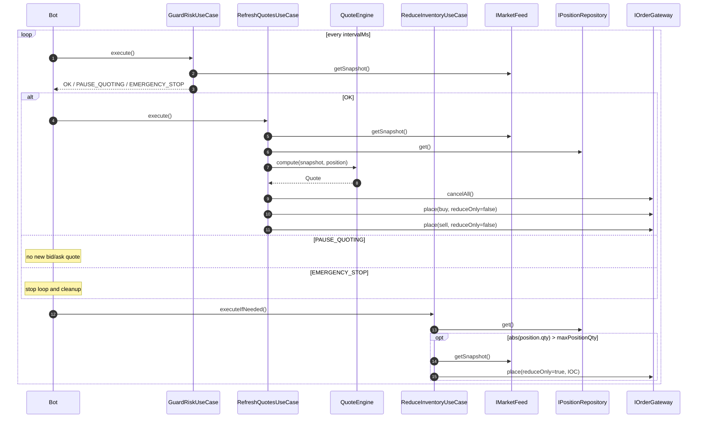
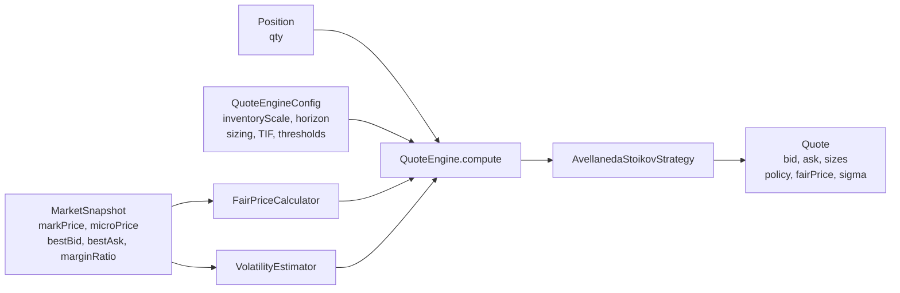

# Strategy

この文書は現在の market making strategy の実装仕様をまとめる。コード上の primary path は Bulk Trade `BTC-USD` の live / paper 実行で、戦略は `AvellanedaStoikovStrategy` を使う。

> ファイル名は現状の依頼に合わせて `storategy.md` とする。

## 目的

bot は継続的に bid / ask を同時提示し、passive maker として spread capture を狙う。最適化の優先順位は以下。

1. margin / position risk を守る
2. 不利な在庫を増やし続けない
3. fair price と短期 volatility に基づいて quote を更新する
4. PnL が改善する範囲で fill rate と uptime を改善する

取引量やランキングは strategy の直接目的にしない。Bulk beta の reward や leaderboard は別レイヤーであり、quote formula には混ぜない。

## Tick Flow

`Bot` の 1 tick は risk guard を先に通し、`OK` のときだけ quote を更新する。inventory reduction は quote 更新とは独立して毎 tick 判定する。



実装対応:

- `GuardRiskUseCase` は `marginRatio < mmrBuffer` で `EMERGENCY_STOP`、`marginRatio < imrBuffer` で `PAUSE_QUOTING` を返す。
- `Bot` は `OK` のときだけ `RefreshQuotesUseCase` を実行する。
- `ReduceInventoryUseCase` は `OK` / `PAUSE_QUOTING` に関係なく tick 末尾で実行される。

## QuoteEngine

`QuoteEngine` は fair price、volatility、sizing、strategy を合成して `Quote` を返す。venue SDK、DB、env には依存しない。



### Fair Price

Fair price は mark price と micro price の線形結合。

```text
fairPrice = markWeight * markPrice + (1 - markWeight) * microPrice
```

Bulk live config の現値:

```text
markWeight = 0.5
```

つまり現在は mark price と micro price を半分ずつ見る。

### Volatility

短期 volatility は mark price の log return から EWMA variance を更新し、標準偏差 `sigma` を返す。

```text
logReturn_t = ln(markPrice_t / markPrice_{t-1})
variance_t = alpha * logReturn_t^2 + (1 - alpha) * variance_{t-1}
sigma_t = sqrt(variance_t)
```

初回、または price が非正のときは price を記録して現在の variance から `sigma` を返す。`alpha` は constructor default の `0.2`。

### Quote Size

quote size は `positionSize` を上限にし、`budgetUsd` があれば fair price で割った数量にも制限する。

```text
quoteSize = min(positionSize, budgetUsd / fairPrice)
```

`budgetUsd` が未設定、または `fairPrice <= 0` のときは `positionSize` をそのまま使う。

Bulk live config の現値:

```text
positionSize = 0.05 BTC
budgetUsd = 250
```

## Avellaneda-Stoikov Variant

この repo の `AvellanedaStoikovStrategy` は quote を以下に分解する。

```text
spread = quote width
skew = inventory-based reservation price shift
reservationPrice = fairPrice - skew
bid = max(0, reservationPrice - spread / 2)
ask = max(0, reservationPrice + spread / 2)
```

### Spread

```text
varianceTerm = sigma^2 * timeHorizonSec
```

`gamma = 0` のときは fixed-spread fallback。

```text
spread = 2 / kappa
```

`gamma > 0` のとき。

```text
spread = gamma * varianceTerm + (2 / gamma) * ln(1 + gamma / kappa)
```

Bulk live config の現値は `gamma = 0`, `kappa = 8` なので、現在の spread は volatility に依存しない。

```text
spread = 2 / 8 = 0.25 USD
```

### Inventory Skew

inventory は `tanh` で正規化して、position が大きくなっても skew が発散しないようにする。

```text
normalizedInventory = tanh(positionQty / inventoryScale)
skew = normalizedInventory * kInv * sigma * sqrt(timeHorizonSec)
reservationPrice = fairPrice - skew
```

long inventory のとき `positionQty > 0` なので `skew > 0` になり、reservation price は fair price より下がる。これにより bid / ask の両方を下げ、sell fill を相対的に促す。

short inventory のときは逆に reservation price が上がり、buy fill を相対的に促す。

Bulk live config の現値:

```text
inventoryScale = 0.5
timeHorizonSec = 10
kInv = 0.05
```

## Order Policy

通常 quote の time in force は config の `defaultTimeInForce` を使う。Bulk live config は `GTC`。

ただし strategy 内で snapshot の `marginRatio` が `slideMarginThreshold` 未満なら、quote policy を `IOC` に切り替える。

```text
policy = marginRatio != null && marginRatio < slideMarginThreshold
  ? IOC
  : defaultTimeInForce
```

Bulk live config の現値:

```text
slideMarginThreshold = 0.08
defaultTimeInForce = GTC
```

注意: tick の先頭で `GuardRiskUseCase` が `marginRatio < imrBuffer` を `PAUSE_QUOTING` にする。Bulk live config は `imrBuffer = 0.08` なので、現在の live path では `marginRatio < 0.08` の tick は `RefreshQuotesUseCase` まで進まない。そのため strategy 内の `IOC` slide は、threshold を risk guard とずらした場合、または直接 `QuoteEngine` を使うテストや別 orchestration で効く。

## Bulk Live Parameters

`config/config.bulk.yml` の current strategy parameters。

| Group    | Parameter            |     Value | Meaning                       |
| -------- | -------------------- | --------: | ----------------------------- |
| market   | `market`             | `BTC-USD` | Bulk target market            |
| loop     | `intervalMs`         |     `250` | tick interval                 |
| fair     | `markWeight`         |     `0.5` | mark / micro blend            |
| sizing   | `positionSize`       |    `0.05` | max quote size in BTC         |
| sizing   | `budgetUsd`          |     `250` | per-order budget cap          |
| strategy | `gamma`              |       `0` | fixed-spread mode             |
| strategy | `kappa`              |       `8` | fixed spread denominator      |
| strategy | `kInv`               |    `0.05` | inventory skew coefficient    |
| risk     | `maxPositionQty`     |     `0.5` | inventory reduction threshold |
| risk     | `imrBuffer`          |    `0.08` | pause quoting threshold       |
| risk     | `mmrBuffer`          |    `0.04` | emergency stop threshold      |
| policy   | `defaultTimeInForce` |     `GTC` | normal quote policy           |

## Inventory Reduction

Inventory reduction is separate from normal quote generation.

```text
if abs(position.qty) <= maxPositionQty:
  do nothing

if position.qty > maxPositionQty:
  sell qty = abs(position.qty) - maxPositionQty
  price = bestBid
  reduceOnly = true
  timeInForce = IOC

if position.qty < -maxPositionQty:
  buy qty = abs(position.qty) - maxPositionQty
  price = bestAsk
  reduceOnly = true
  timeInForce = IOC
```

この use case は ordinary quote placement の risk check に依存しない。過大 inventory を閉じる処理なので、`reduceOnly=true` と `IOC` を固定する。

## Tuning Policy

PnL-first で扱うため、parameter tuning では以下の順に見る。

1. `netPnl`, `pnlPerNotional`, drawdown
2. adverse markout / stale feed / order lifecycle inconsistency
3. inventory skew と reduce-only close cost
4. fill rate

`fillRate` が低いだけで `kappa` を上げて spread を狭めると、負の PnL を拡大する可能性がある。fill rate 改善は PnL と markout が許容範囲にあるときだけ実行する。

## Source Map

- `src/application/Bot.ts`: tick loop、risk state 分岐、quote count、cleanup
- `src/application/usecases/GuardRiskUseCase.ts`: margin risk state 判定
- `src/application/usecases/RefreshQuotesUseCase.ts`: snapshot / position 取得、quote 計算、cancel / place
- `src/application/usecases/ReduceInventoryUseCase.ts`: max inventory 超過時の reduce-only IOC
- `src/domain/QuoteEngine.ts`: fair price、volatility、quote sizing、strategy context 合成
- `src/domain/FairPriceCalculator.ts`: mark / micro blended fair price
- `src/domain/VolatilityEstimator.ts`: EWMA volatility
- `src/domain/strategy/avellaneda-stoikov/AvellanedaStoikovStrategy.ts`: spread、skew、reservation price、policy
- `src/domain/strategy/avellaneda-stoikov/AvellanedaStoikovParams.ts`: strategy parameter schema
- `config/config.bulk.yml`: current Bulk live parameters
