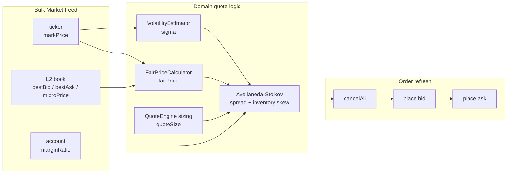
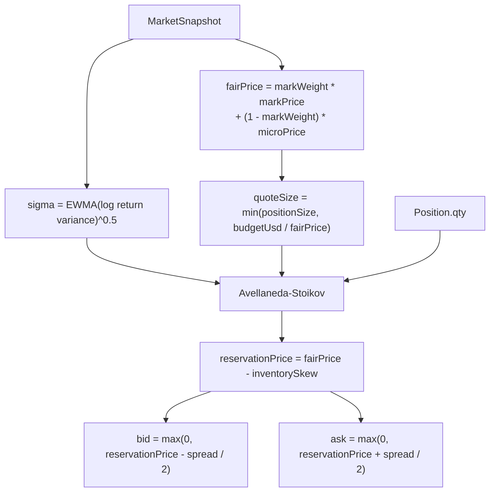
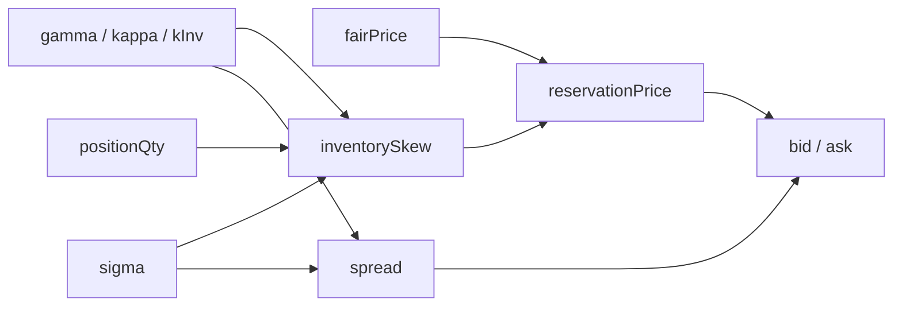
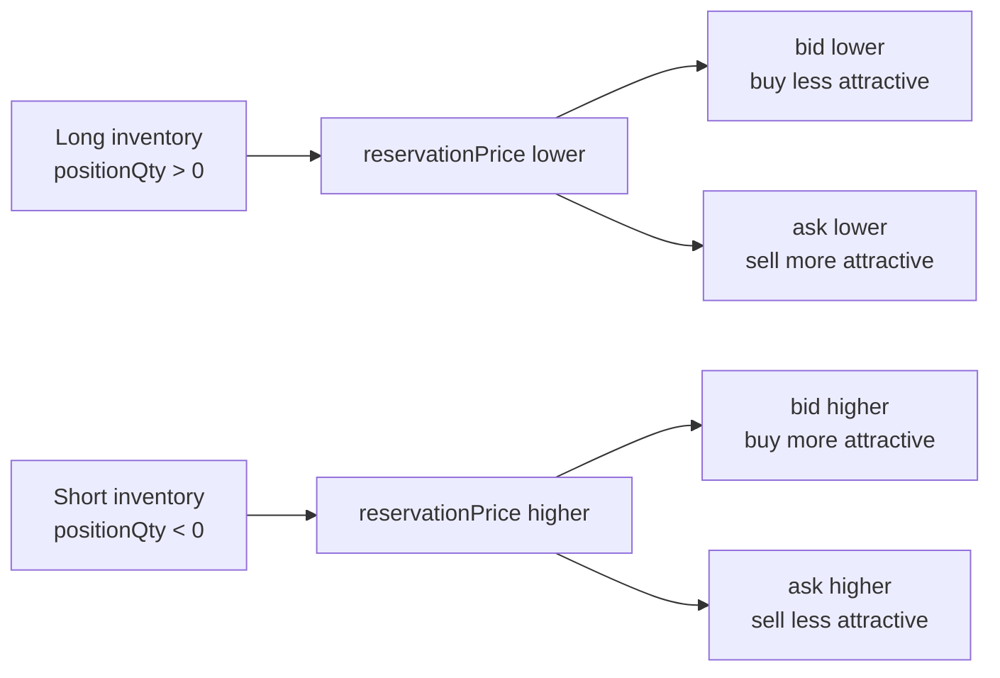
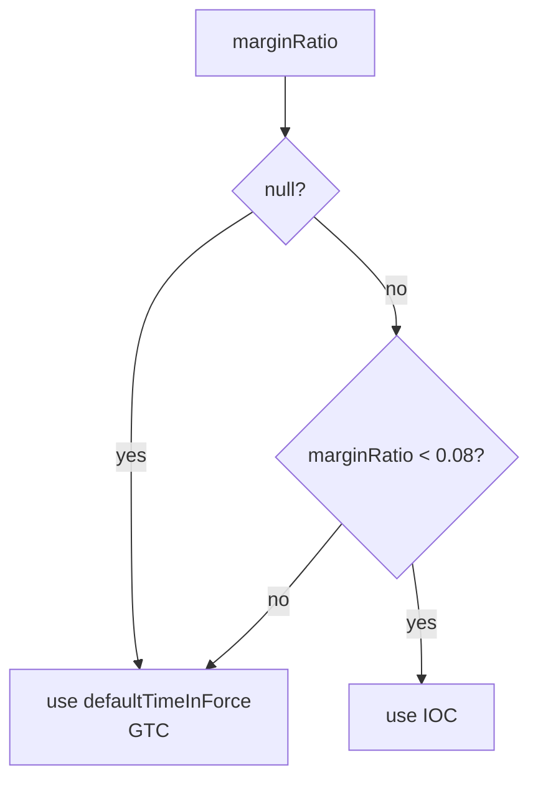
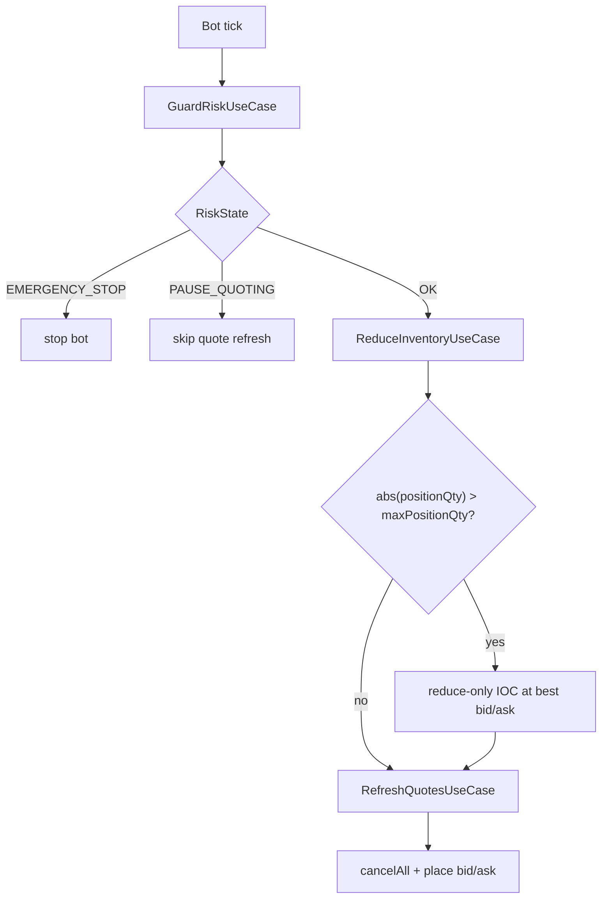
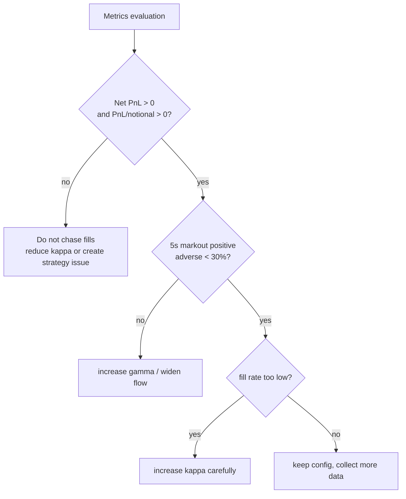

# Current MM Strategy

この文書は、現在の `simple-mm-bot` が実際に使っている market making strategy を、実装に沿って説明する。

対象は `config/config.bulk.yml` の Bulk live 設定と、`src/domain/QuoteEngine.ts` / `src/domain/strategy/avellaneda-stoikov/AvellanedaStoikovStrategy.ts` の現行ロジック。
ここでは leaderboard volume ではなく、PnL を作るための quote 生成と risk control の流れに絞る。

## 全体像



1 tick ごとに `RefreshQuotesUseCase` が market snapshot と現在 position を読み、`QuoteEngine` で bid / ask を作る。
その後、既存注文を全キャンセルしてから、新しい buy quote と sell quote を 1 本ずつ出す。

## 現在の設定

`config/config.bulk.yml` の現在値:

| 項目                   |    現在値 | 役割                                         |
| ---------------------- | --------: | -------------------------------------------- |
| `market`               | `BTC-USD` | quote 対象 market                            |
| `intervalMs`           |     `250` | tick 間隔                                    |
| `markWeight`           |     `0.5` | mark price と micro price の混合比           |
| `inventoryScale`       |     `0.5` | inventory skew の正規化幅                    |
| `timeHorizonSec`       |      `10` | spread / skew が見る短期 horizon             |
| `slideMarginThreshold` |    `0.08` | margin ratio が低いとき IOC に切り替える閾値 |
| `defaultTimeInForce`   |     `GTC` | 通常 quote の time in force                  |
| `positionSize`         |    `0.05` | 片側 quote の最大 base size                  |
| `budgetUsd`            |     `250` | 片側 quote の USD 上限                       |
| `minSpreadBps`         |     `5.6` | fee 負けを避ける最小 quote 幅                |
| `gamma`                |       `0` | risk aversion。現在は fixed-spread fallback  |
| `kappa`                |       `8` | spread の基準。`gamma=0` では `2 / kappa`    |
| `kInv`                 |    `0.05` | inventory skew の強さ                        |
| `maxPositionQty`       |     `0.5` | これを超える在庫は reduce-only IOC で削る    |

## Quote 生成フロー



### 1. Fair price

`FairPriceCalculator` は mark price と micro price を混ぜる。

```text
fairPrice = markWeight * markPrice + (1 - markWeight) * microPrice
```

現在の `markWeight` は `0.5` なので、mark と micro を半分ずつ見る。
micro price は板の top depth を反映するため、単純な mid price より order book の偏りを拾いやすい。

### 2. Volatility

`VolatilityEstimator` は直近 price の log return を EWMA で分散化し、平方根を `sigma` として返す。

```text
logReturn = log(currentMarkPrice / previousMarkPrice)
variance  = alpha * logReturn^2 + (1 - alpha) * previousVariance
sigma     = sqrt(variance)
```

`alpha` の default は `0.2`。
直近の値動きが大きいほど `sigma` が上がり、`gamma > 0` のとき spread と inventory skew に反映される。

### 3. Quote size

片側の発注 size は `positionSize` と `budgetUsd / fairPrice` の小さい方。

```text
quoteSize = min(positionSize, budgetUsd / fairPrice)
```

BTC が高いほど `budgetUsd` 側で size が絞られる。
現在は `positionSize = 0.05`、`budgetUsd = 250` なので、BTC-USD では通常 `budgetUsd / fairPrice` が上限になる。

## Avellaneda-Stoikov 部分

この bot の strategy は、fair price を中心に次の 2 つを計算する。



### Spread

`gamma = 0` の場合、strategy spread は fixed-spread fallback になる。

```text
strategySpread = 2 / kappa
```

現在は `kappa = 8` なので:

```text
strategySpread = 2 / 8 = 0.25
```

これは price の絶対値幅で、bps ではない。BTC-USD のような高価格 market では非常に細い幅になるため、Bulk config は fee-aware な `minSpreadBps` を下限として適用する。

`gamma > 0` の場合は Avellaneda-Stoikov 型の spread を使う。

```text
varianceTerm = sigma^2 * timeHorizonSec
spread = gamma * varianceTerm + (2 / gamma) * log(1 + gamma / kappa)
```

最終的な quote 幅:

```text
minSpread = fairPrice * minSpreadBps / 10_000
spread = max(strategySpread, minSpread)
```

直感:

| 値      | 上げるとどうなるか                                      |
| ------- | ------------------------------------------------------- |
| `gamma` | risk aversion が強くなり、spread が広がりやすい         |
| `sigma` | 値動きが荒いほど spread が広がる                        |
| `kappa` | 大きいほど fixed-spread fallback では spread が狭くなる |

### Inventory skew

在庫が偏っていると、reservation price をずらして片側の約定を起こしやすくする。

```text
normalizedInventory = tanh(positionQty / inventoryScale)
inventorySkew = normalizedInventory * kInv * sigma * sqrt(timeHorizonSec)
reservationPrice = fairPrice - inventorySkew
```

`tanh` を使うので、position が大きくなっても skew はなめらかに飽和する。



結果:

| Position | reservation price | 期待する効果                            |
| -------- | ----------------- | --------------------------------------- |
| Long     | 下がる            | sell 側を約定させやすくして在庫を減らす |
| Short    | 上がる            | buy 側を約定させやすくして在庫を戻す    |
| Flat     | fair price 近辺   | symmetric quote                         |

## Final quote

最終的な quote は以下。

```text
bid = max(0, reservationPrice - spread / 2)
ask = max(0, reservationPrice + spread / 2)
bidSize = quoteSize
askSize = quoteSize
```

通常は `defaultTimeInForce = GTC`。
ただし market snapshot の `marginRatio` があり、`marginRatio < slideMarginThreshold` のときは `IOC` に切り替える。



## Risk controls around strategy

Strategy は bid / ask を作るだけで、risk control は use case 側で囲っている。



Risk thresholds:

| Risk             | 条件                                | 動作                            |
| ---------------- | ----------------------------------- | ------------------------------- |
| `EMERGENCY_STOP` | `marginRatio < mmrBuffer`           | bot を止める                    |
| `PAUSE_QUOTING`  | `marginRatio < imrBuffer`           | quote refresh を止める          |
| Reduce inventory | `abs(positionQty) > maxPositionQty` | 超過分を reduce-only IOC で削る |

現在値:

| 項目             |     値 |
| ---------------- | -----: |
| `imrBuffer`      | `0.08` |
| `mmrBuffer`      | `0.04` |
| `maxPositionQty` |  `0.5` |

## PnL-first tuning guide

現在の改善 loop は、volume ではなく PnL を優先する。



Guideline:

| 状態                                  | 優先する判断                                  |
| ------------------------------------- | --------------------------------------------- |
| Net PnL が負                          | fill rate を上げない                          |
| PnL per notional が非正               | volume を増やさない                           |
| markout が負                          | 逆選択を疑い、spread / risk aversion を見直す |
| PnL も markout も良いが fill が少ない | 初めて `kappa` を上げる候補になる             |

## 実装対応表

| 内容                   | 実装                                                                  |
| ---------------------- | --------------------------------------------------------------------- |
| tick orchestration     | `src/application/Bot.ts`                                              |
| quote refresh          | `src/application/usecases/RefreshQuotesUseCase.ts`                    |
| risk gate              | `src/application/usecases/GuardRiskUseCase.ts`                        |
| inventory reduction    | `src/application/usecases/ReduceInventoryUseCase.ts`                  |
| quote composition      | `src/domain/QuoteEngine.ts`                                           |
| fair price             | `src/domain/FairPriceCalculator.ts`                                   |
| volatility             | `src/domain/VolatilityEstimator.ts`                                   |
| strategy formula       | `src/domain/strategy/avellaneda-stoikov/AvellanedaStoikovStrategy.ts` |
| strategy params schema | `src/domain/strategy/avellaneda-stoikov/AvellanedaStoikovParams.ts`   |
| Bulk live params       | `config/config.bulk.yml`                                              |
